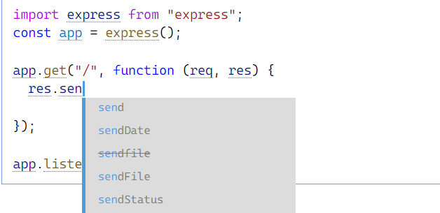
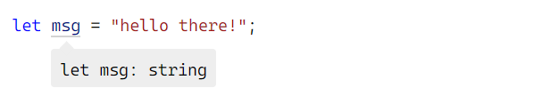
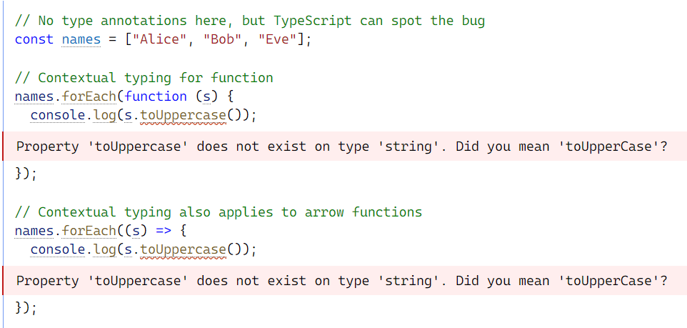
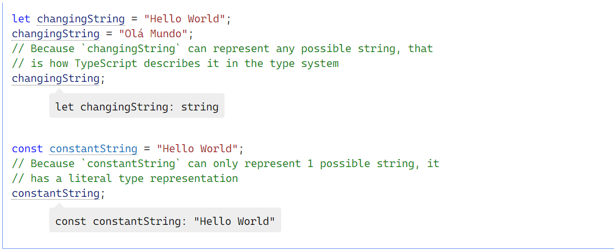
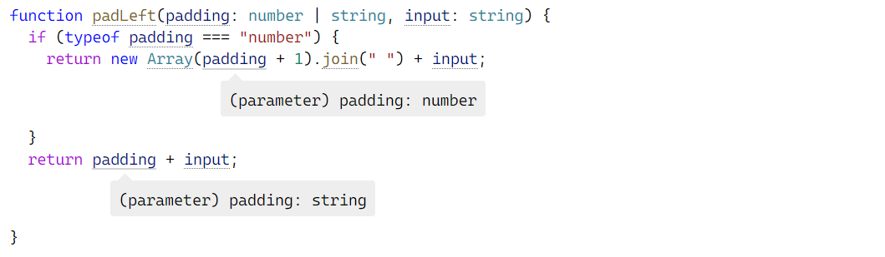

[TOC]


# 开始吧

## 新程序员的TypeScript

恭喜你选择TypeScript作为你的第一语言之一ーー你已经做出了正确的决定！

您可能已经听说过，TypeScript 是 JavaScript 的一种“风格”或“变体”。在现代编程语言中，TypeScript (TS)和 JavaScript (JS)之间的关系是相当独特的，因此了解这种关系将有助于您理解 TypeScript 是如何添加到 JavaScript 中的。

### 什么是 JavaScript? 简史

JavaScript (也被称为 ECMAScript)最初只是一个简单的浏览器脚本语言。在它被发明出来的时候，人们期望它被用于嵌入到网页中的短代码片段ーー编写几十行以上的代码有些不同寻常。正因为如此，早期的浏览器执行这些代码的速度相当缓慢。随着时间的推移，JS 变得越来越流行，网络开发者开始使用它来创建交互式体验。

Web 浏览器开发人员通过优化他们的执行引擎(javascript 动态编译)和扩展可以用它做的事情(添加 api)来回应 JS 使用量的增加，这反过来又使 Web 开发人员使用它更多。在现代网站上，你的浏览器经常运行跨越数十万行代码的应用程序。这是“网络”长期而渐进的发展，从一个简单的静态页面网络开始，逐渐演变成一个各种丰富应用程序的平台。

不仅如此，JS 已经变得非常流行，可以在浏览器之外使用，比如使用 node.JS 实现 JS 服务器。JS 的“随处运行”特性使其成为跨平台开发的一个有吸引力的选择。现在有很多开发者只使用 JavaScript 来编写他们的整个堆栈！

总而言之，我们有一种专门为快速使用而设计的语言，然后发展成为一种成熟的工具，可以编写具有数百万行代码的应用程序。每种语言都有它自己的怪癖ーー奇怪和令人惊讶的地方，JavaScript 的低级开始使得它有很多这样的怪癖。以下是一些例子:

* JavaScript 的相等运算符(= =)强制了它的参数，导致了意想不到的行为:

  ```js
  if ("" == 0) {
  // It is! But why??
  }
  if (1 < x < 3) {
  // True for *any* value of x!
  }
  ```

* 还允许访问不存在的属性:

  ```ts
  const obj = { width: 10, height: 15 };
  // Why is this NaN? Spelling is hard!
  const area = obj.width * obj.heigth;
  ```

大多数编程语言在出现这类错误时都会抛出一个错误，有些会在编译过程中抛出错误——在任何代码运行之前。当编写小程序时，这种怪癖很烦人，但是可以控制; 当编写带有成百上千行代码的应用程序时，这些不断出现的意外是一个严重的问题。

### TypeScript:静态类型检查器

我们之前说过有些语言根本不允许那些漏洞百出的程序运行。在不运行代码的情况下检测代码中的错误称为静态检查。根据操作的值的类型来确定什么是错误，什么不是错误，这被称为静态类型检查。

打字稿在执行之前检查程序是否有错误，并根据值的类型进行检查，它是一个静态类型检查器。例如，上面的最后一个例子有一个错误，因为 obj 的类型。下面是发现的错误打字稿:

```typescript
const obj = { width: 10, height: 15 };
const area = obj.width * obj.heigth;
//Property 'heigth' does not exist on type '{ width: number; height: number; }'. Did you mean 'height'?
```

#### 一个类型化的 JavaScript 超集

和 JavaScript 有什么关系呢？

#### 语法

是 JavaScript 的超集: JS 语法因此是合法的 TS。语法是指我们编写文本以形成程序的方式。例如，这段代码有一个语法错误，因为它缺少 a) :

```typescript
let a = (4
//')' expected.
```

TypeScript不认为任何 JavaScript 代码是一个错误，因为它的语法。这意味着你可以把任何正常工作的 JavaScript 代码放到一个TypeScript文件中，而不用担心它是怎么写的。

#### 类型

但是，TypeScript 是一个类型化超集，这意味着它添加了关于如何使用不同类型值的规则。关于 obj.heigth 的早期错误不是语法错误: 它是以不正确的方式使用某种类型的值(类型)的错误。

另一个例子是 JavaScript 代码，你可以在你的浏览器中运行，它会记录一个值:

```js
console.log(4 / []);
```

这个语法合法的程序记录 Infinity。但是 TypeScript 认为数组的除法是一个无意义的操作，并且会发出一个错误:

```typescript
console.log(4 / []);
//The right-hand side of an arithmetic operation must be of type 'any', 'number', 'bigint' or an enum type.
```

你可能真的想用数组除以一个数，也许只是为了看看会发生什么，但是大多数时候，这是一个编程错误。TypeScript的类型检查器被设计成允许正确的程序通过，同时仍然能够捕获尽可能多的常见错误。(稍后，我们将了解可以用来配置TypeScript如何严格检查代码的设置。)

如果您将一些代码从 JavaScript 文件移动到 TypeScript 文件，您可能会看到类型错误，这取决于代码的编写方式。这些可能是代码的合理问题，或者是TypeScript过于保守。在本指南中，我们将演示如何添加各种TypeScript语法来消除这些错误。

####  运行时行为

TypeScript也是一种保留 JavaScript 运行时行为的编程语言。例如，在 JavaScript 中除以零会产生 Infinity，而不是抛出运行时异常。作为一个原则，TypeScript 从不改变 JavaScript 代码的运行时行为。

这意味着如果你把代码从 JavaScript 转移到 TypeScript，它肯定会以同样的方式运行，即使 TypeScript 认为代码有类型错误。

保持与 JavaScript 相同的运行时行为是 TypeScript 的一个基本承诺，因为这意味着您可以轻松地在两种语言之间进行转换，而不必担心可能导致程序停止工作的细微差别。

#### 被擦除的类型

粗略地说，一旦 TypeScript 的编译器完成了对代码的检查，它就会删除这些类型以生成结果的“已编译”代码。这意味着，一旦编译了代码，生成的纯 JS 代码没有类型信息。

这也意味着TypeScript永远不会根据推断出的类型更改程序的行为。底线是，尽管在编译期间可能会看到类型错误，但类型系统本身与程序运行时的工作方式无关。

最后，TypeScript 不提供任何额外的运行时库。您的程序将使用与 JavaScript 程序相同的标准库(或外部库) ，因此不需要学习其他特定于TypeScript的框架。

#### 学习 JavaScript 和 TypeScript

我们经常会遇到这样的问题: “我应该学习 JavaScript 还是TypeScript?”。

答案是，如果你不学习 JavaScript，你就无法学习TypeScript！分享了 JavaScript 的语法和运行时行为，所以你所学到的任何关于 JavaScript 的知识都可以同时帮助你学习TypeScript。

有很多很多资源可以让程序员学习 JavaScript; 如果你正在编写TypeScript，你不应该忽略这些资源。例如，标记 javascript 的 StackOverflow 问题是TypeScript的20倍，但是所有的 javascript 问题也适用于TypeScript。

如果您正在搜索“如何在TypeScript中对列表进行排序”之类的内容，请记住: TypeScript 是 JavaScript 的运行时，带有编译时类型检查器。在TypeScript中对列表进行排序的方式和在 JavaScript 中是一样的。如果您找到了一个直接使用TypeScript的资源，那也很好，但是不要把自己局限于认为您需要为如何完成运行时任务的日常问题提供特定于TypeScript的答案。

## 为 JavaScript 程序员设计的TypeScript

和 JavaScript 之间有着不同寻常的关系。提供了所有 JavaScript 的特性，并且在这些特性之上增加了一层: TypeScript 的类型系统。

例如，JavaScript 提供了类似string和number这样的语言原语，但是它不检查你是否一贯地分配这些原语。TypeScript检查。

这意味着您现有的工作 JavaScript 代码也是 TypeScript 代码。TypeScript的主要好处是它可以突出显示代码中的意外行为，降低出现 bug 的可能性。

本教程提供了一个TypeScript的简要概述，重点介绍了它的类型系统。

### Types by Inference通过推理的类型

TypeScript熟悉 JavaScript 语言，在很多情况下会为你生成类型。例如，在创建变量并将其分配给特定值时，TypeScript 将使用该值作为类型。

```typescript
let helloWorld = "Hello World";
        
//let helloWorld: string
```

通过理解 JavaScript 的工作原理，TypeScript 可以构建一个接受 JavaScript 代码但具有类型的类型系统。这提供了一个类型系统，无需添加额外的字符就可以在代码中显式显示类型。这就是为什么 TypeScript 在上面的例子中知道 helloWorld 是一个字符串。

您可能已经在 visualstudiocode 中编写了 JavaScript，并具有编辑器自动完成功能。Visual Studio Code 在底层使用了 TypeScript，使得使用 JavaScript 更加容易。

### Defining Types定义类型

您可以在 JavaScript 中使用各种各样的设计模式。但是，有些设计模式使得类型难以自动推断(例如，使用动态编程的模式)。为了涵盖这些情况，TypeScript 支持 JavaScript 语言的一个扩展，它为你提供了告诉 TypeScript 类型应该是什么。

例如，要创建包含 name: string 和 id: number 的隐式类型的对象，可以写入:

```typescript
const user = {
  name: "Hayes",
  id: 0,
};
```

你可以使用一个接口声明来显式地描述这个对象的形状:

```typescript
interface User {
  name: string;
  id: number;
}
```

然后你可以在变量声明之后使用类似: TypeName 的语法声明一个 JavaScript 对象符合你的新接口的形状:

```typescript
const user: User = {
  name: "Hayes",
  id: 0,
};
```

如果你提供的对象与你提供的接口不匹配，TypeScript 会警告你:

```typescript
interface User {
  name: string;
  id: number;
}

const user: User = {
  username: "Hayes",
//Type '{ username: string; id: number; }' is not assignable to type 'User'.Object literal may only specify known properties, and 'username' does not exist in type 'User'.
  id: 0,
};
```

因为 JavaScript 支持类和面向对象程序设计，所以 TypeScript 也是如此，你可以对类使用一个接口声明:

```typescript
interface User {
  name: string;
  id: number;
}

class UserAccount {
  name: string;
  id: number;

  constructor(name: string, id: number) {
    this.name = name;
    this.id = id;
  }
}

const user: User = new UserAccount("Murphy", 1);
```

你可以使用接口对参数进行注释，并将值返回给函数:

```typescript
function getAdminUser(): User {
  //...
}

function deleteUser(user: User) {
  // ...
}
```

在 JavaScript 中已经有一小组基本类型可用: boolean、 bigint、 null、 number、 string、 symbol 和 undefined，您可以在接口中使用它们。TypeScript 扩展了这个列表，比如 any (allow anything)、 unknown (确保使用这个类型的人声明了类型是什么)、 never (这种类型不可能发生)和 void (返回未定义或没有返回值的函数)。

您将看到构建类型有两种语法: interfaces和types。你应该更喜欢接口。需要特殊功能时使用类型。

### Composing Types构建类型

使用 TypeScript，您可以通过组合简单的类型来创建复杂的类型。有两种流行的方法可以做到这一点: 用unions（联合），和用Generics（泛型）。

#### Unions联合

使用联合，您可以声明一个类型可以是许多类型之一。例如，你可以将布尔类型描述为 true 或 false:

```typescript
type MyBool = true | false;
```

注意: 如果你把鼠标悬停在 MyBool 上面，你会看到它被归类为布尔值。这是结构类型系统的一个属性。以下是更多关于这个的信息。

一个流行的联合类型用例是描述允许值为的字符串或数字字面量的集合:

```typescript
type WindowStates = "open" | "closed" | "minimized";
type LockStates = "locked" | "unlocked";
type PositiveOddNumbersUnderTen = 1 | 3 | 5 | 7 | 9;
```

联合也提供了一种处理不同类型的方法。例如，你可能有一个接受数组或字符串的函数:

```typescript
function getLength(obj: string | string[]) {
  return obj.length;
}
```

要知道变量的类型，使用 typeof:

| Type 类型          | Predicate 断言                     |
| :----------------- | :--------------------------------- |
| string 弦          | `typeof s === "string"`            |
| number 数字        | `typeof n === "number"`            |
| boolean 布尔       | `typeof b === "boolean"`           |
| undefined 未定义的 | `typeof undefined === "undefined"` |
| function 函数      | `typeof f === "function"`          |
| array 数组         | `Array.isArray(a)`                 |

例如，你可以让一个函数返回不同的值，这取决于它传递的是字符串还是数组:

```typescript
function wrapInArray(obj: string | string[]) {
  if (typeof obj === "string") {
    return [obj];
           //(parameter) obj: string
  } else {
    return obj;
  }
}
```

#### Generics泛型

泛型为类型提供变量。一个常见的例子是数组。没有泛型的数组可以包含任何内容。带泛型的数组可以描述数组包含的值。

```typescript
type StringArray = Array<string>;
type NumberArray = Array<number>;
type ObjectWithNameArray = Array<{ name: string }>;
```

你可以声明你自己使用泛型的类型:

```typescript
interface Backpack<Type> {
  add: (obj: Type) => void;
  get: () => Type;
}

// This line is a shortcut to tell TypeScript there is a
// constant called `backpack`, and to not worry about where it came from.
declare const backpack: Backpack<string>;

// object is a string, because we declared it above as the variable part of Backpack.
const object = backpack.get();

// Since the backpack variable is a string, you can't pass a number to the add function.
backpack.add(23);
// Argument of type 'number' is not assignable to parameter of type 'string'.
```

### Structural Type System结构类型系统

TypeScript的核心原则之一是类型检查关注值的形状。这有时被称为“ duck typing”或“ structural typing”。

在结构类型系统中，如果两个对象具有相同的形状，则认为它们是同一类型的。

```typescript
interface Point {
  x: number;
  y: number;
}

function logPoint(p: Point) {
  console.log(`${p.x}, ${p.y}`);
}

// logs "12, 26"
const point = { x: 12, y: 26 };
logPoint(point);
```

point 变量永远不会被声明为 Point 类型。但是，TypeScript在类型检查中将point的形状与Point的形状进行比较。它们具有相同的形状，因此代码可以通过。

形状匹配只需要匹配对象字段的一个子集。

```typescript
const point3 = { x: 12, y: 26, z: 89 };
logPoint(point3); // logs "12, 26"

const rect = { x: 33, y: 3, width: 30, height: 80 };
logPoint(rect); // logs "33, 3"

const color = { hex: "#187ABF" };
logPoint(color);
//	Argument of type '{ hex: string; }' is not assignable to parameter of type 'Point'.Type '{ hex: string; }' is missing the following properties from type 'Point': x, y

```

类和对象符合形状的方式没有区别:

```typescript
class VirtualPoint {
  x: number;
  y: number;

  constructor(x: number, y: number) {
    this.x = x;
    this.y = y;
  }
}

const newVPoint = new VirtualPoint(13, 56);
logPoint(newVPoint); // logs "13, 56"
```

如果对象或类具有所有必需的属性，无论实现细节如何，TypeScript 都会说它们匹配。

# 手册

## 1、TypeScript手册

### 关于这本手册

在被引入编程社区20多年后，JavaScript 现在已经成为有史以来最广泛使用的跨平台语言之一。作为一个为网页添加琐碎的交互性的小脚本语言，JavaScript 已经成长为一种前端和后端应用程序的首选语言。虽然用 JavaScript 编写的程序的大小、范围和复杂性都呈指数级增长，但 JavaScript 语言表达不同代码单元之间关系的能力却没有。结合 JavaScript 特有的运行时语义，语言和程序复杂性之间的不匹配使得 JavaScript 的开发成为一项难以规模化管理的任务。

程序员编写的最常见的错误类型可以被描述为类型错误: 在需要不同类型值的地方使用了某种类型的值。这可能是由于简单的拼写错误、未能理解库的 API 表面、对运行时行为的错误假设或其他错误。TypeScript 的目标是成为 JavaScript 程序的静态类型检查器——换句话说，它是一个在代码运行(静态)之前运行的工具，并确保程序的类型是正确的(类型检查)。

如果你打算在没有 JavaScript 背景的情况下开始ts，并且打算把ts作为你的第一种语言，我们建议你首先从 Mozilla Web 文档开始阅读关于 JavaScript 的文档。如果你有其他语言的经验，你应该能够通过阅读手册快速学会 JavaScript 语法。

### 这本手册是如何构建的

该手册分为两部分:

* 手册

手册旨在成为一份向普通程序员解释打字脚本的综合性文档。你可以在左边的导航栏里从上到下阅读这本手册。

您应该期望每一章节或每一页都能为您提供对给定概念的深刻理解。手册并不是一个完整的语言规范，但是它是一个关于语言的所有特性和行为的全面指南。

完成本演练的读者应该能够:	

> 阅读和理解常用的ts语法和模式
>
> 解释重要编译器选项的效果
>
>  在大多数情况下正确预测类型系统行为

为简明扼要起见，《手册》的主要内容将不探讨所涵盖特征的每一个边缘案例或细节。你可以在参考文章中找到关于特定概念的更多细节。

- 参考文件

导航手册下面的参考部分是为了更好地理解ts的特定部分是如何工作的。你可以从头到尾地阅读它，但是每个部分都旨在对单一概念提供更深入的解释——这意味着没有连续性的目标。

### 非目标

《手册》还打算成为一份简明的文件，可以在几个小时内轻松阅读。为了简短起见，某些话题不会被涉及。

具体来说，这本手册没有完全介绍 JavaScript 的核心基础知识，比如函数、类和闭包。在适当的地方，我们将包括背景阅读的链接，你可以用它来阅读这些概念。

该手册也不打算成为语言规范的替代品。在某些情况下，将跳过边缘案例或行为的正式描述，以利于高层次的、易于理解的解释。相反，有一些单独的参考页面更加精确和形式化地描述了ts行为的许多方面。参考页面不是为不熟悉打字稿的读者准备的，所以他们可能使用了你还没有读过的高级术语或参考主题。

最后，手册不会介绍ts如何与其他工具交互，除非有必要。诸如如何用 webpack、 rollup、 parcel、 react、 babel、 closure、 lerna、 rush、 bazel、 preact、 vue、 angular、 svelte、 jquery、 yarn 或 npm 配置ts的主题已经超出了范围——你可以在网上的其他地方找到这些资源。

### 开始吧

## 2、基本知识

欢迎来到手册的第一页，如果这是你第一次使用打字稿，你可以从“开始吧”开始

JavaScript 中的每个值都有一组行为，您可以通过运行不同的操作来观察它们。这听起来很抽象，但是作为一个简单的例子，考虑一下我们可能在一个名为 message 的变量上运行的一些操作。

```js
// Accessing the property 'toLowerCase'
// on 'message' and then calling it
message.toLowerCase();
// Calling 'message'
message();
```

如果我们分解它，第一行可运行的代码访问一个名为 toLowerCase 的属性，然后调用它。第二个试图直接调用message。

但是假设我们不知道message的值——这是很常见的——我们不能可靠地说我们试图运行这些代码会得到什么结果。每个操作的行为完全取决于我们最初拥有的值。

* message可调用吗？
* 有个叫toLowerCase的属性吗？
* 如果有，toLowerCase可调用吗？
* 如果message和toLowerCase都是可调用的，它返回什么？

这些问题的答案通常是当我们写js代码的时候在我们脑袋里会思考的事情，并且我们不得不希望我们保持所有的细节正确。

让我们看看下面定义的message

```typescript
const message = "Hello World!";
```

正如我们可能猜到的，如果我们尝试运行message.toLowerCase(),我们会得到只有小写字母的同样的字符串。

代码的第二行怎么了？如果你对js熟悉，你会知道这是一个exception的错误。

```typescript
TypeError: message is not a function
```

如果我们能够避免像这样的错误就太好了。

当我们运行我们的代码，js runtime选择做什么的方式是通过弄清楚值的类型-它有哪种行为和能力。那是TypeError暗指的部分-就是说字符串“Hello World！”不能作为函数来调用。

对于一些类型，比如原类型string和number，我们能够通过typeof操作符在runtime辨别他们的类型。但是对于像函数的其他类型，没有相应的runtime机制来辨别他们的类型。例如，考虑这个函数：

```js
function fn(x) {
    return x.flip();
}
```

我们通过阅读代码可以发现这个函数只有在具有可调用flip属性的对象时才会工作，但是当代码运行时，js不以我们能检查的方式显示这个信息。在纯js中如果想要知道带特定值的fn做什么，就调用它并且看看发生了什么。这种行为使在代码运行之前预测它会做什么很困难，这意味着想要知道当你正在写代码时你的代码将要做什么会很困难。

以这种方式看，一个type是描述哪个值能被传递给fn并且哪个会崩溃的概念。js只提供动态类型检查-运行代码看看发生什么。

另一种选择是使用静态类型系统在运行之前去预测代码会发生什么。

### 静态类型检查

返回TypeError想想，我们最早把一个字符串当作函数调用。大多数人不喜欢运行代码的时候出现错误-这些被认为是bug！并且当我们写新代码时，我们尽我们的努力避免引入新bug。

如果我们刚刚添加一些代码，保存我们的文件，重运行代码，并且立即看到错误，我们可能能够很快地隔离这个错误；但是那不总是那种情况。我们可能还没有足够充分的测试这个特性，因此我们可能实际上从来没有进入抛出的潜在的错误。或者如果我们足够幸运的目击到这个错误，我们可能已经终止大量的重构，并且添加被强迫挖掘的大量不同的代码。

理想的是，我们可能有一个工具帮助我们在我们的代码运行之前发现这些bug。那是像ts这样的静态类型检查做的事情。静态类型系统描述当我们运行我们的程序时我们的值会变成的形状和行为。一个像ts类型检查器使用哪个信息并且告诉我们什么时候事情可能正在离轨道。

```typescript
const message = "hello!";
message();
//This expression is not callable.Type 'String' has no call signatures.
```

在我们首先运行代码之前，用ts写上面的例子将会向我们提示错误。

### 非例外故障

目前我们一直在讨论运行时错误的某些事情-JavaScript运行时告诉我们它认为某些东西是荒谬的。之所以会出现这些情况，是因为 ECMAScript 规范明确指出，当遇到意外情况时，该语言应该如何表现。

例如，规范说，试图调用不可调用的东西应该抛出错误。也许这听起来像是“显而易见的行为”，但是您可以想象，访问对象上不存在的属性也应该抛出错误。相反，JavaScript 给出了不同的行为，并返回未定义的值:

```typescript
const user = {
  name: "Daniel",
  age: 26,
};
user.location; // returns undefined
```

最终，静态类型系统必须调用系统中应该标记为错误的代码，即使它是“有效的”JavaScript，不会立即抛出错误。在 TypeScript 中，下面的代码会产生一个关于未定义位置的错误:

```typescript
const user = {
  name: "Daniel",
  age: 26,
};

user.location;
// Property 'location' does not exist on type '{ name: string; age: number; }'.
```

虽然有时候这意味着在你能表达的东西上有所取舍，但是我们的目的是在我们的程序中捕捉合法的 bug。而且ts捕捉了很多合法的漏洞。

例如：错别字（typos），

```typescript
const announcement = "hello World!";

//How quickly can you spot the typos?
announcement.toLocaleLowercase();
announcement.toLocalLowerCase();

//We probably meant to write this...
announcement.toLocaleLowerCase();
```

未调用的函数，

```typescript
function flipCoin() {
    //Meant to be Math.random()
    return Math.random < 0.5;
    // Operator  '<' cannot be applied to types '() => number' and 'number'.
}
```

或基本逻辑错误。

```typescript
const value = Math.random() < 0.5 ? "a" : "b";
if (value !== "a") {
  // ...
} else if (value === "b") {
//This condition will always return 'false' since the types '"a"' and '"b"' have no overlap.
  // Oops, unreachable
}
```

### 工具类型

当我们在代码中出错时ts能捕捉bug。那很棒，但是ts能第一时间阻止我们出现bug。

类型检查器有信息来检测是否我们访问了变量的正确属性和其他属性。一旦它有信息，它也能开始建议你可能想要使用哪个属性。

这意味着可以利用 TypeScript 来编辑代码,并且核心类型检查器能提供错误信息和当你在把编辑器敲代码时代码自动完成。这是人们在讨论ts中的工具时经常提到的一部分。



ts非常重视工具，而且在输入时不仅仅是自动完成和错误提示。一个支持ts的编辑器可以提供“快速修复”来自动修复错误，重构代码以方便地重新组织代码，以及有用的导航功能，用于跳转到变量的定义，或查找给定变量的所有引用。所有这些都构建在类型检查器之上，并且是完全跨平台的，因此您喜欢的编辑器很可能具有可用的ts支持。

### tsc，类型编译器

我们一直在谈论类型检查，但是我们还没有使用我们的类型检查器。让我们来了解一下我们的新朋友 tsc，编译器。首先，我们需要通过 npm 获取它。

```shell
npm install -g typescript
```

这将在全局安装ts编译器 tsc。如果您希望从本地节点 _ 模块包运行 tsc，可以使用 npx 或类似的工具。

现在让我们移动到一个空文件夹并且尝试写我们的第一个ts程序:hello.ts:

```typescript
// Greets the world.
console.log("hello world!");
```

注意，这里没有修饰; 这个“ hello world”程序看起来与用 JavaScript 编写的“ hello world”程序一模一样。然后现在让我们来通过运行命令tsc对他做类型检查，这是通过ts包为我们安装的。

```shell
tsc hello.ts
```

嗒嗒！

等等，“嗒嗒”到底是什么？我们运行了 tsc，什么都没发生！嗯，没有类型错误，所以我们没有得到任何输出在我们的控制台，因为没有什么要报告。

但再次检查-我们得到了一些文件输出代替。如果我们查看我们的工作目录文件夹，我们会看到一个 hello.js 文件在 hello.ts 旁边。这是在 tsc 编译或转换为纯 JavaScript 文件之后，hello.ts 文件的输出。如果我们检查内容，我们会看到ts在处理了一个.ts文件之后输出了什么:

```js
// Greets the world.
console.log("Hello world!");
```

在这种情况下，几乎没有什么需要ts转换的地方，所以它看起来和我们写的一模一样。编译器试图发出清晰可读的代码，这些代码看起来像是人们编写的代码。虽然这并不总是那么容易，但是 TypeScript 始终如一地缩进，注意我们的代码跨越不同代码行的时间，并尽量保留注释。

如果我们引入了一个类型检查错误呢? 让我们重写 hello.ts:

```typescript
// This is an industrial-grade general-purpose greeter function:
function greet(person, date) {
  console.log(`Hello ${person}, today is ${date}!`);
}

greet("Brendan");
```

如果我们再一次运行tsc hello.ts，注意到我们在命令行出现一个错误！

```shell
Expected 2 arguments, but got 1.
```

ts正在告诉我们我们忘记了像greet函数传递一个参数，这是正确的。到目前为止我们仅仅写了标准的js，然后类型检查器依然能够返现我们代码的错误。谢谢ts！

### 发出错误

一件你可能还没有从上一个例子注意到的事情是我们的hello.js文件再次改变了。如果我们打开这个文件，我们会看到它的内容看起来基本上和我们的输入文件一样。考虑到 tsc 报告了一个关于我们代码的错误，这可能有点令人惊讶，但这是基于ts的核心价值之一: 大多数时候，你会比ts更清楚。

为了重申以前的观点，类型检查代码限制了可以运行的程序类型，因此类型检查器可以在哪些类型的事情上进行权衡。在大多数情况下，这是可以的，但是在某些情况下，这些检查会成为障碍。例如，想象自己将 JavaScript 代码迁移到 TypeScript 并引入类型检查错误。最终，您将抽出时间为类型检查器清理东西，但是原始的 JavaScript 代码已经在工作了！为什么把它转换成ts就不能运行了呢？

所以ts不会妨碍你。当然，随着时间的推移，你可能需要对错误采取更多的防御措施，并使ts更加严格。在这种情况下，您可以使用 -- noEmitOnError 编译器选项。尝试更改 hello.ts 文件并使用该标志运行 tsc:

```shell
tsc --noEmitOnError hello.ts
```

你会发现hello.js再也不会更新。

### 显式类型

到目前为止，我们还没有告诉TypeScript person是什么，date是什么。让我们编辑代码，告诉 TypeScript person是一个字符串，那个date应该是一个 Date 对象。我们还将在date上使用 toDateString ()方法。

```typescript
function greet(person: string, date: Date) {
  console.log(`Hello ${person}, today is ${date.toDateString()}!`);
}
```

我们所做的就是在 person 和 date 上添加类型注释来描述什么类型的值可以调用 greet。你可以阅读签名作为“ greet 采用字符串类型的人，和日期类型的date”。

有了这个，TypeScript 可以告诉我们其他一些可能被错误调用的情况。例如......

```typescript
function greet(person: string, date: Date) {
  console.log(`Hello ${person}, today is ${date.toDateString()}!`);
}

greet("Maddison", Date());
//Argument of type 'string' is not assignable to parameter of type 'Date'.
```

Huh? TypeScript reported an error on our second argument, but why?

哈？ts在第二行报告一个错误，不是为什么呢？也许令人惊讶的是，在 JavaScript 中调用 Date ()将返回一个字符串。另一方面，构造一个带有new Date ()的 Date 实际上给了我们所期望的。

无论如何，我们可以快速修复这个错误:

```typescript
function greet(person: string, date: Date) {
  console.log(`Hello ${person}, today is ${date.toDateString()}!`);
}

greet("Maddison", new Date());
```

请记住，我们并不总是需要编写明确的类型注释。在许多情况下，即使我们省略了类型，TypeScript 甚至可以为我们推断(或者“推断出”)类型。



尽管我们没有告诉打字脚本 msg 有类型字符串，但是它能够解决这个问题。这是一个特性，当类型系统最终推断出相同的类型时，最好不要添加注释。

`注意: 上面的代码示例中的消息冒泡。如果你在这个单词上徘徊，你的编辑就会这么做。`

### 擦除类型

让我们看看当我们用tsc编译上面的函数greet成js文件会发生什么：

```typescript
"use strict";
function greet(person, date) {
    console.log("Hello " + person + ", today is " + date.toDateString() + "!");
}
greet("Maddison", new Date());
```

这里注意两件事：

1. person和date参数不再有类型注释。
2. 模板字符串-用回勾(`字符)的字符串-被转换成用+连接的普通字符串。

后面我们会详细讨论第二点，但是现在让我们关注第一点。类型注释不是 JavaScript 的一部分(或者说 ECMAScript 是迂腐的) ，所以真的没有任何浏览器或者其他运行时可以不经修改就运行ts。这就是为什么ts首先需要一个编译器——它需要某种方法去掉或转换任何特定于ts的代码，以便您可以运行它。大多数特定于ts的代码都会被擦除，同样，这里的类型注释也被完全擦除。

`记住：类型注释从来不会改变你程序的运行时行为。`

### 下调

与上面的另一个区别是，我们的模板字符串被由：

```typescript
`Hello ${person}, today is ${date.toDateString()}!`;
```

重写成：

```ts
"Hello " + person + ", today is " + date.toDateString() + "!";
```

为什么会这样呢？

模板字符串是 ECMAScript 2015版本的一个特性，称为 ECMAScript 2015(也就是 ECMAScript 6、 ES2015、 ES6等等——不要问)。ts能够将新版本的 ECMAScript 代码重写到旧版本，如 ECMAScript 3或 ECMAScript 5(又名 ES3和 ES5)。从一个更新或“更高”的 ECMAScript 版本下降到一个更旧或“更低”版本的过程有时被称为下调。

默认情况下，ts的目标是 ES3，一个非常老的 ECMAScript 版本。我们可以使用 -- target 标志选择一些更新的内容。使用-- target es2015将ts更改为针对 ECMAScript 2015，这意味着代码应该能够在支持 ECMAScript 2015的任何地方运行。因此，运行 tsc -- target es2015 hello.ts 可以得到以下输出:

```js
function greet(person, date) {
  console.log(`Hello ${person}, today is ${date.toDateString()}!`);
}
greet("Maddison", new Date());
```

`虽然默认的目标是 ES3，但目前大多数浏览器都支持 ES2015。因此，大多数开发人员可以安全地将 ES2015或以上指定为目标，除非与某些古老浏览器的兼容性很重要。`

### 精确性

不同的用户使用ts在类型检查器中寻找不同的东西。有些人正在寻找一个更松散的选择-在经验，可以帮助验证他们的程序只有一些部分，仍然有体面的工具。这是 TypeScript 的默认体验，其中类型是可选的，推断采用最宽松的类型，并且不检查潜在的 null/undefined 值。就像 tsc 在面对错误时发出的信号一样，这些默认值被放置在适当的位置以避免您的干扰。如果您正在迁移现有的 JavaScript，这可能是一个可取的第一步。

相比之下，很多用户更喜欢让 TypeScript 尽可能直接地进行验证，这就是为什么该语言也提供了严格的设置。这些严格的设置将静态类型检查从开关(无论您的代码是否被检查)转变为更接近于刻度盘的设置。你拨号拨得越远，越多的ts会为你检查。这可能需要一些额外的工作，但一般来说，从长远来看，这样做是值得的，并且可以进行更彻底的检查和更精确的工具。如果可能的话，一个新的代码库应该总是启用这些严格的检查。

TypeScript 有几个类型检查严格性标志，可以打开或关闭，除非另有说明，否则我们所有的示例都是在启用它们的情况下编写的。CLI 中的 -- strict 标志，或者叫做“ strict”: 在 tsconfig.json 中为 true，可以同时切换所有选项，但是我们可以单独选择退出。你应该知道的两个最重要的检查是 noImplicitAny 和 strictnullcheck。

#### `noImplicitAny`

回想一下，在某些地方，TypeScript 并没有尝试为我们推断任何类型，而是回到了最宽松的类型: any。这并不是最糟糕的事情——毕竟，回到any都只是纯粹的 JavaScript 体验。

然而，使用any常常首先都会违背使用ts的初衷。您的程序输入的类型越多，您得到的验证和工具就越多，这意味着您在编码过程中遇到的 bug 就越少。打开 noImplicitAny 标志将对任何类型被隐式推断为 any 的变量发出错误。

#### `strictNullChecks`

默认情况下，像 null 和 undefined 这样的值可以分配给任何其他类型。这可以让编写代码变得更容易，但是忘记处理 null 和未定义的代码会导致世界上无数的 bug ——有些人认为这是一个十亿美元的错误！Stricttnullchecks 标志使处理 null 和 undefined 变得更加明确，使我们不必担心是否忘记处理 null 和 undefined。

## 3、日常类型

在本章中，我们将介绍一些在 JavaScript 代码中值的最常见的类型，并解释在 TypeScript 中描述这些类型的相应方法。这并不是一个详尽的列表，以后的章节将描述更多命名和使用其他类型的方法。

类型还可以出现在许多地方，而不仅仅是类型注释。当我们了解类型本身时，我们还将了解可以引用这些类型来形成新结构的位置。

我们将首先回顾一下在编写 JavaScript 或ts代码时可能遇到的最基本和最常见的类型。这些将在以后形成更复杂类型的核心构建块。

### 原语: 字符串、数字和布尔值

js有三种非常常用的原语: 字符串、数字和布尔值。每个都有一个相应的ts类型。正如您可能预期的那样，如果对这些类型的值使用 javascript typeof 操作符，您将看到这些名称: 

* string 表示字符串值，如“ Hello，world”
* number 表示类似42的数字。JavaScript 对于整数没有一个特殊的运行时值，所以没有与 int 或 float 等价的东西——一切都只是number
* boolean是有两个值 true 和 false 的 Number Boolean。

> 类型名字 String、 Number 和 Boolean (以大写字母开头)是合法的，但是引用一些特殊的内置类型，这些类型很少出现在代码中。对于类型，总是使用字符串、数字或布尔值。

### 数组

为了指定像【1，2，3】这样的数组类型，你可以使用语法`number[]`;这个语法适用于任何类型(例如:string[]是一个字符串的数组，等等)。你也可以写成`Array<number>`,效果一样。当我们学到泛型的时候会了解关于语法`T<U>`的更多。

> 注意[number]是不同的东西；参考元组类型部分

### `any`

ts也有一个特殊类型，any，你可以在任何你不想要由特殊值引起类型检查错误的地方使用。

当一个值的类型是 any 时，你可以访问它的任何属性(反过来也可以是 any 类型的属性) ，像调用函数一样调用它，将它赋给(或从)任何类型的值，或者几乎所有其他在语法上合法的属性:

```typescript
let obj: any = { x: 0 };
// 以下代码行都不会抛出编译器错误。使用‘ any’将禁用所有进一步的类型检查，并且假定您比 TypeScript 更了解环境。
obj.foo();
obj();
obj.bar = 100;
obj = "hello";
const n: number = obj;
```

当你不想仅仅为了让ts相信某一行代码是可行的而写出一个长类型时，any 类型是很有用的。

`noImplicitAny`

如果不指定类型，并且 TypeScript 不能从上下文推断出类型，编译器通常会默认为any。

不过，您通常希望避免这种情况，因为没有对any进行检查。使用编译器标记 noImplicitAny 将任何隐含的any标记为错误。

### 变量的类型注释

使用 const、 var 或 let 声明变量时，可以选择添加类型注释以显式指定变量的类型:

```typescript
let myName: string = "Alice";
```

>ts不使用“类型在左边”风格的声明，比如 int x = 0; 类型注释总是紧跟在输入的内容之后。

然而，在大多数情况下，这是不必要的。只要有可能，TypeScript 就会尝试自动推断代码中的类型。例如，变量的类型是基于其初始化器的类型来推断的:

```typescript
// No type annotation needed -- 'myName' inferred as type 'string'
let myName = "Alice";
```

在大多数情况下，您不需要明确地学习推理的规则。如果你刚开始使用，尝试使用比你想象的更少的类型注释——你可能会惊讶于你需要 TypeScript 来完全理解发生了什么。

### 函数

函数是 JavaScript 中传递数据的主要方式。允许您指定函数的输入和输出值的类型。

#### 参数类型注释

在声明函数时，可以在每个参数后面添加类型注释，以声明函数接受哪些类型的参数。参数类型注释跟在参数名后面:

```typescript
// Parameter type annotation
function greet(name: string) {
  console.log("Hello, " + name.toUpperCase() + "!!");
}
```

当一个参数具有类型注释时，该函数的参数将被检查:

```typescript
// Would be a runtime error if executed!
greet(42);
//Argument of type 'number' is not assignable to parameter of type 'string'.
```

> 即使您的参数上没有类型注释，TypeScript 仍然会检查您传递的参数数量是否正确。

#### 返回类型注释

你也可以添加返回类型注释，返回类型注释会出现在参数列表之后:

```typescript
function getFavoriteNumber(): number {
  return 26;
}
```

很像变量类型注释，您通常不需要返回类型注释，因为 TypeScript 将根据函数的返回语句推断其返回类型。上面示例中的类型注释不会改变任何东西。有些代码库为了文档目的，为了防止意外的更改，或者仅仅为了个人喜好，会显式地指定返回类型。

#### 匿名函数

匿名函数与函数声明略有不同。当一个函数出现在可以决定如何调用它的地方时，该函数的参数将自动给定类型。

例如：



尽管参数 s 没有类型注释，但 TypeScript 使用 forEach 函数的类型以及数组的推断类型来确定 s 将具有的类型。

这个过程称为上下文类型化，因为函数发生的上下文告诉了它应该具有什么类型。与推理规则类似，您不需要明确地了解这种情况是如何发生的，但是了解它确实发生了可以帮助您注意到何时不需要类型注释。稍后，我们将看到更多示例，说明值出现的上下文如何影响其类型。

### 对象类型

除了基本类型之外，最常见的类型是对象类型。这指的是任何带有属性的 JavaScript 值，这几乎是所有的属性！要定义对象类型，只需列出其属性及其类型。

例如，这里有一个接受点状对象的函数:

```typescript
// The parameter's type annotation is an object type
function printCoord(pt: { x: number; y: number }) {
  console.log("The coordinate's x value is " + pt.x);
  console.log("The coordinate's y value is " + pt.y);
}
printCoord({ x: 3, y: 7 });
```

在这里，我们用具有两个属性(x 和 y)的类型对参数进行了注释，这两个属性都是 number 类型。您可以使用，或; 来分隔属性，最后一个分隔符是可选的。

每个属性的类型部分也是可选的。如果没有指定类型，则假定它是any类型。

#### 可选属性

对象类型还可以指定其部分或全部属性是可选的。要做到这一点，添加一个？在属性名称后面:

```typescript
function printName(obj: { first: string; last?: string }) {
  // ...
}
// Both OK
printName({ first: "Bob" });
printName({ first: "Alice", last: "Alisson" });
```

在 JavaScript 中，如果你访问一个不存在的属性，你会得到一个未定义的值，而不是一个运行时错误。因此，当您从可选属性读取时，在使用它之前必须检查未定义的属性。

```typescript
function printName(obj: { first: string; last?: string }) {
  // Error - might crash if 'obj.last' wasn't provided!
  console.log(obj.last.toUpperCase());
Object is possibly 'undefined'.
  if (obj.last !== undefined) {
    // OK
    console.log(obj.last.toUpperCase());
  }

  // A safe alternative using modern JavaScript syntax:
  console.log(obj.last?.toUpperCase());
}
```

### 联合类型

ts的类型系统允许您使用大量的操作符在现有类型的基础上构建新的类型。现在我们知道了如何编写一些类型，是时候开始以有趣的方式组合它们了。

#### 定义一个联合类型

组合类型的第一种方法是联合类型。联合类型是由两个或多个其他类型组成的类型，表示可能是其中任何一个类型的值。我们将这些类型中的每一种称为联合成员。

让我们编写一个可以操作字符串或数字的函数:

```typescript
function printId(id: number | string) {
  console.log("Your ID is: " + id);
}
// OK
printId(101);
// OK
printId("202");
// Error
printId({ myID: 22342 });
/*
类型“{ myID: number; }”的参数不能分配给类型“ string | number”的参数。类型“{ myID: number; }”不能分配给类型“ number”。*/
```

#### 与联合类型合作

如果 union 对每个成员都有效，则 TypeScript 将只允许您使用 union 进行处理。例如，如果你有联合字符串 | 数字，你不能使用只能在字符串上使用的方法:

```typescript
function printId(id: number | string) {
  console.log(id.toUpperCase());
/*
Property 'toUpperCase' does not exist on type 'string | number'.Property 'toUpperCase' does not exist on type 'number'.
*/
}
```

解决方案是用代码缩小联合，就像在 JavaScript 中不使用类型注释一样。当 TypeScript 可以根据代码的结构推断出某个值的更特定的类型时，就会发生收缩。

例如，TypeScript 知道只有一个字符串值才有一个“ string”的typeof值:

```typescript
function printId(id: number | string) {
  if (typeof id === "string") {
    // In this branch, id is of type 'string'
    console.log(id.toUpperCase());
  } else {
    // Here, id is of type 'number'
    console.log(id);
  }
}
```

另一个例子是使用类似于 Array.isArray 的函数:

```typescript
function welcomePeople(x: string[] | string) {
  if (Array.isArray(x)) {
    // Here: 'x' is 'string[]'
    console.log("Hello, " + x.join(" and "));
  } else {
    // Here: 'x' is 'string'
    console.log("Welcome lone traveler " + x);
  }
}
```

注意，在 else 分支中，我们不需要做任何特殊的操作——如果 x 不是字符串[] ，那么它一定是一个字符串。

有时你会遇到一个所有成员都有共同点的联合。例如，数组和字符串都有一个切片方法。如果联合中的每个成员都有一个共同属性，则可以使用该属性而不进行收缩:

```typescript
// Return type is inferred as number[] | string
function getFirstThree(x: number[] | string) {
  return x.slice(0, 3);
}
```

>类型的联合似乎具有这些类型的属性的交集，这可能令人困惑。这并非偶然——联合的名称来自于类型理论。联合number | string由每个类型的值的联合组成。请注意，给定两个集合，每个集合都有相应的事实，只有这些事实的交集适用于集合本身的并。例如，如果我们有一个房间的高个子戴着帽子，而另一个房间的西班牙人戴着帽子，在合并了这些房间之后，我们唯一知道的就是每个人都必须戴着帽子。

### 类型别名

我们通过直接在类型注释中编写对象类型和联合类型来使用它们。这很方便，但是通常希望多次使用同一类型并使用单个名称引用它。

类型别名就是这样——任何类型的名称。类型别名的语法是:

```typescript
type Point = {
  x: number;
  y: number;
};

// 与前面的例子完全相同
function printCoord(pt: Point) {
  console.log("The coordinate's x value is " + pt.x);
  console.log("The coordinate's y value is " + pt.y);
}

printCoord({ x: 100, y: 100 });
```

实际上，您可以使用类型别名为任何类型提供名称，而不仅仅是对象类型。例如，类型别名可以命名联合类型:

```typescript
type ID = number | string;
```

请注意别名只是别名——您不能使用别名来创建同一类型的不同的“版本”。当您使用别名时，就像您编写了别名类型一样。换句话说，这段代码可能看起来是非法的，但是根据ts来看是可以的，因为这两种类型都是同一类型的别名:

```typescript
type UserInputSanitizedString = string;

function sanitizeInput(str: string): UserInputSanitizedString {
  return sanitize(str);
}

// 创建一个经过净化的输入
let userInput = sanitizeInput(getInput());

// 仍然可以用字符串重新分配
userInput = "new input";
```

### 接口

接口声明是命名对象类型的另一种方式:

```typescript
interface Point {
  x: number;
  y: number;
}

function printCoord(pt: Point) {
  console.log("The coordinate's x value is " + pt.x);
  console.log("The coordinate's y value is " + pt.y);
}

printCoord({ x: 100, y: 100 });
```

就像我们上面使用类型别名时一样，这个示例的工作方式就像我们使用了匿名对象类型一样。TypeScript 只关心我们传递给 printCoord 的值的结构——它只关心它是否具有预期的属性。仅仅关注类型的结构和功能，这就是为什么我们称ts为结构类型系统。

#### 类型别名和接口之间的区别

类型别名和接口非常相似，在许多情况下，您可以在它们之间自由选择。接口的几乎所有特性都是类型可用的，**关键区别在于不能重新打开类型以添加新的属性，而接口总是可扩展的**.

| 接口                                                         | 类型                                                         |
| ------------------------------------------------------------ | ------------------------------------------------------------ |
| 扩展接口                                                     | 通过交叉点扩展类型                                           |
| interface Animal {   name: string }<br />interface Bear extends Animal {   honey: boolean } <br />const bear = getBear()  <br />bear.name <br />bear.honey | type Animal = {   name: string } <br />type Bear = Animal & {    honey: Boolean  } <br />const bear = getBear(); <br />bear.name;<br />bear.honey; |

向现有接口添加新字段:

```typescript
interface Window {
  title: string
}

interface Window {
  ts: TypeScriptAPI
}

const src = 'const a = "Hello World"';
window.ts.transpileModule(src, {});
```

类型创建后不能更改:

```typescript
type Window = {
  title: string
}

type Window = {
  ts: TypeScriptAPI
}

 // Error: Duplicate identifier 'Window'.

```

在以后的章节中你会学到更多关于这些概念的知识，所以如果你不能马上理解所有这些知识，不要担心。

* 在ts版本4.2之前，类型别名可能会出现在错误消息中，有时会替代等效的匿名类型(这可能是可取的，也可能不是)。接口将始终在错误消息中命名。
* 类型别名可能不参与声明合并，但接口可以。
* 接口只能用于声明对象的形状，而不能重命名原语。
* 接口名称将始终以原始形式出现在错误消息中，但仅当它们按名称使用时才会出现。

在大多数情况下，你可以根据个人喜好进行选择，ts会告诉你它是否需要其他类型的声明。如果你想要一个启发式，使用interface，直到你需要使用来自type的特性。

### 类型断言(as)

有时候你会得到一个值的类型信息，而ts是不能知道的。

例如，如果你正在使用document.getElementById,ts仅仅知道这将返回某种htmlElement，但是你可能知道你的页面将总是有一个带给定id的一个HTMLCanvasElement。

在这种情况下，你可以用一个类型断言来指定一个更明确的类型：

```typescript
const myCanvas = document.getElementById("main_canvas") as HTMLCanvasElement;
```

和类型注释一样，类型断言会被编译器移除，并且不会影响你代码的运行时行为。

你也可以用尖括号语法（除非代码在.tsx 文件中），那是等价的：

```typescript
const myCanvas = <HTMLCanvasElement>document.getElementById("main_canvas");
```

> 提醒: 因为类型断言是在编译时删除的，所以不存在与类型断言关联的运行时检查。如果类型断言错误，则不会生成异常或 null。

ts只允许类型断言转换为更具体或更不具体的类型版本。这条规则可以防止“不可能”的强制性条款，比如:

```typescript
const x = "hello" as number;
/* 
Conversion of type 'string' to type 'number' may be a mistake because neither type sufficiently overlaps with the other. If this was intentional, convert the expression to 'unknown' first.
*/
```

有时这个规则可能过于保守，不允许更复杂的有效强制。如果出现这种情况，您可以使用两个断言，首先是针对 any (或者我们将在后面介绍的 unknown) ，然后是所需的类型:

```typescript
const a = (expr as any) as T;
```

### 文字类型

除了一般类型字符串和数字之外，我们还可以在类型位置中引用特定的字符串和数字。

考虑这个问题的一种方法是考虑 JavaScript 是如何以不同的方式声明变量的。Var 和 let 都允许改变变量内部的值，而 const 不允许。这反映在 TypeScript 如何为文本创建类型上。



文字类型本身并不是很有价值:

```typescript
let x: "hello" = "hello";
// OK
x = "hello";
// ...
x = "howdy";
//Type '"howdy"' is not assignable to type '"hello"'.
```


拥有一个只能有一个值的变量是没有多大用处的！

但是，通过将文字组合成联合，可以表达一个更有用的概念——例如，只接受一组已知值的函数:

```typescript
function printText(s: string, alignment: "left" | "right" | "center") {
  // ...
}
printText("Hello, world", "left");
printText("G'day, mate", "centre");
//Argument of type '"centre"' is not assignable to parameter of type '"left" | "right" | "center"'.
```

数值文字类型的工作原理是相同的:

```typescript
function compare(a: string, b: string): -1 | 0 | 1 {
  return a === b ? 0 : a > b ? 1 : -1;
}
```

当然，你可以把它们和非文字类型结合起来:

```typescript
interface Options {
  width: number;
}
function configure(x: Options | "auto") {
  // ...
}
configure({ width: 100 });
configure("auto");
configure("automatic");
// Argument of type '"automatic"' is not assignable to parameter of type 'Options | "auto"'.
```

还有一种文字类型: 布尔文字。只有两种布尔文字类型，正如您可能猜到的，它们是 true 和 false 类型。类型 boolean 本身实际上只是 union true | false 的别名。

#### 字面推理

当使用对象初始化变量时，TypeScript 假定该对象的属性稍后可能更改值。例如，如果你写了这样的代码:

```typescript
const obj = { counter: 0 };
if (someCondition) {
  obj.counter = 1;
}
```

不会假设将1分配给先前有0的字段是一个错误。另一种说法是 obj.counter 必须具有类型number，而不是0，因为类型用于决定读取和写入行为。

这同样适用于字符串:

```typescript
const req = { url: "https://example.com", method: "GET" };
handleRequest(req.url, req.method);
// 类型“ string”的参数不能分配给类型“ GET”| “ POST”的参数
```

在上面的示例中，req.method 被推断为 string，而不是“ GET”。因为代码可以在 req 的创建和 handleRequest 的调用之间进行计算，handleRequest 可以为 req.method 分配一个新字符串，比如“ GUESS”，所以 TypeScript 认为这段代码有错误。

有两种方法可以解决这个问题。

1. 您可以通过在任一位置添加类型断言来更改推断:

   ```typescript
   // Change 1:
   const req = { url: "https://example.com", method: "GET" as "GET" };
   // Change 2
   handleRequest(req.url, req.method as "GET");
   ```

   更改1意味着“我希望 req.method 始终具有文本类型‘GET’ ”，这样可以防止“ GUESS”被赋值到后面的字段。Change 2意味着“因为其他原因，我知道 req.method 的值为“ GET”

2. 可以使用 const 将整个对象转换为文本类型:

   ```
   const req = { url: "https://example.com", method: "GET" } as const;
   handleRequest(req.url, req.method);
   ```

As const 后缀的作用类似于 const，但是对于类型系统，确保所有属性都被分配为文本类型，而不是字符串或数字之类的更一般的版本。

### `null`和`undefined`

JavaScript 有两个用于表示缺失或未初始化值的基本值: null 和 undefined。

有两个相同名字的对应类型。这些类型的行为取决于是否启用了 stritnullchecks 选项。

#### `strictNullChecks`off

关闭 strictnullcheck 后，仍然可以正常访问可能为 null 或undefined的值，null 和undefined的值可以分配给任何类型的属性。这类似于没有空检查的语言(例如 c # 、 Java)的行为。缺乏对这些值的检查往往是 bug 的一个主要来源; 我们总是建议人们在他们的代码库中开启strictNullChecks，如果这样做可行。

#### `strictNullChecks`on

开启strictNullChecks，当一个值为空或未定义时，您需要在对该值使用方法或属性之前测试这些值。就像在使用可选属性之前检查未定义的值一样，我们可以使用收缩来检查可能为 null 的值:

```typescript
function doSomething(x: string | null) {
  if (x === null) {
    // do nothing
  } else {
    console.log("Hello, " + x.toUpperCase());
  }
}
```

#### 非空断言运算符(后缀`!`)

ts还有一种特殊的语法，用于在不进行任何显式检查的情况下从类型中删除 null 和undefined的内容。写作！在任何表达式之后都是一个类型断言，该值不是 null 或undefined的:

```typescript
function liveDangerously(x?: number | null) {
  // No error
  console.log(x!.toFixed());
}
```

就像其他类型断言一样，这不会改变代码的运行时行为，因此只使用它是很重要的！当您知道该值不能为null或undefined时。

### 枚举

枚举是由 TypeScript 添加到 JavaScript 的一个特性，它允许描述一个值，这个值可以是一组可能的命名常量之一。与大多数ts特性不同，这不是 JavaScript 的类型级别增加，而是添加到语言和运行时中的。正因为如此，这是一个你应该知道存在的特性，但是除非你确定，否则可以推迟使用。您可以在 Enum 参考页面中阅读更多有关 Enum 的内容。

### 不太常见的原语

值得一提的是 JavaScript 中的其余原语，它们在类型系统中表示。虽然我们不会在这里深入探讨。

##### `bigint`

从 ES2020开始，JavaScript 中有一个用于非常大的整数的原语，BigInt:

```typescript
// Creating a bigint via the BigInt function
const oneHundred: bigint = BigInt(100);

// Creating a BigInt via the literal syntax
const anotherHundred: bigint = 100n;
```

您可以在 TypeScript 3.2发行说明中了解更多关于 BigInt 的信息。

##### `symbol`

JavaScript 中有一个原语，用于通过函数 Symbol ()创建一个全局唯一引用:

```typescript
const firstName = Symbol("name");
const secondName = Symbol("name");

if (firstName === secondName) {
/This condition will always return 'false' since the types 'typeof firstName' and 'typeof secondName' have no overlap.
  // Can't ever happen
```

你可以在 Symbols 参考页面了解更多关于它们的信息。

## 4、收缩

假设我们有一个名为 padLeft 的函数。

```typescript
function padLeft(padding: number | string, input: string): string {
  throw new Error("Not implemented yet!");
}
```

如果 padding 是一个number，那么它将把这个数字当作我们想要预置到input的空格数。如果padding是一个string，它应该只是预先padding到input。让我们尝试实现当 padLeft 传递一个number作为padding时的逻辑。

```typescript
function padLeft(padding: number | string, input: string) {
  return new Array(padding + 1).join(" ") + input;
/Operator '+' cannot be applied to types 'string | number' and 'number'.
}
```

啊哦，我们在 padding + 1上得到一个错误。正在警告我们，向一个数字 | 字符串添加一个数字可能不会给我们想要的，这是正确的。换句话说，我们没有明确地检查填充是否是一个数字，也没有处理它是一个字符串的情况，所以让我们确切地这样做。

```typescript
function padLeft(padding: number | string, input: string) {
  if (typeof padding === "number") {
    return new Array(padding + 1).join(" ") + input;
  }
  return padding + input;
}
```

如果这看起来像是一段乏味的 JavaScript 代码，那么这就是问题所在。除了我们放置的注释，这个 TypeScript 代码看起来像 JavaScript。理想的是ts的类型系统旨在让编写典型的 JavaScript 代码变得尽可能简单，而不用为了类型安全而拼命工作。

虽然看起来不怎么样，但实际上这里有很多隐藏的东西。就像 TypeScript 如何使用静态类型分析运行时值一样，它将类型分析覆盖在 JavaScript 的运行时控制流结构上，比如 if/else、条件三极结构、循环、 truthiness 检查等，这些都会影响这些类型。

在我们的 if 检查中，TypeScript 看到 typeof padding = = = “ number”，并将其理解为一种称为类型保护的特殊形式的代码。ts遵循可能的执行路径，我们的程序可以采用这些路径来分析给定位置上某个值的最具体的可能类型。它查看这些特殊检查(称为类型保护)和赋值，将类型细化为比声明的更特定的类型的过程称为缩小。在许多编辑器中，我们可以在这些类型更改时观察它们，我们甚至会在示例中这样做。



有几种不同的 TypeScript 结构可以用于收缩。

### `typeof`类型保护

正如我们所看到的，JavaScript 支持typeof的运算符，它可以给出运行时值类型的非常基本的信息。希望返回一组特定的字符串:

- `"string"`
- `"number"`
- `"bigint"`
- `"boolean"`
- `"symbol"`
- `"undefined"`
- `"object"`
- `"function"`

正如我们在 padLeft 中看到的，这个操作符经常出现在许多 JavaScript 库中，而且 TypeScript 可以理解它来缩小不同分支中的类型。

在 TypeScript 中，根据 typeof 返回的值进行检查是一种类型保护。因为 TypeScript 编码 typeof 如何对不同的值进行操作，所以它知道 JavaScript 的一些怪异之处。例如，注意在上面的列表中，typeof 没有返回字符串 null。看看下面的例子:

```typescript
function printAll(strs: string | string[] | null) {
  if (typeof strs === "object") {
    for (const s of strs) {
/Object is possibly 'null'.
      console.log(s);
    }
  } else if (typeof strs === "string") {
    console.log(strs);
  } else {
    // do nothing
  }
}
```

在 printAll 函数中，我们尝试检查 strs 是否是一个对象，以确定它是否是一个数组类型(现在可能是强调数组在 JavaScript 中是对象类型的好时机)。但事实证明，在 JavaScript 中，typeof null 实际上是“ object”！这是历史上不幸的事件之一。

有足够经验的用户可能不会感到惊讶，但并不是每个人都在 JavaScript 中遇到过这种情况; 幸运的是，TypeScript 让我们知道 strs 只限于 string [] | null 而不是 string[].

这可能是一个很好的切入点，我们称之为“真实性”检查。

### 真实性缩小

Truthiness 可能不是你可以在字典里找到的词，但是你可以在 JavaScript 中听到这个词。

在 JavaScript 中，我们可以在条件句、 & & s、 | | s、 if 语句、布尔否定(!)中使用任何表达式，以及更多。例如，if语句不期望它们的条件总是具有 boolean 类型。

```typescript
function getUsersOnlineMessage(numUsersOnline: number) {
  if (numUsersOnline) {
    return `There are ${numUsersOnline} online now!`;
  }
  return "Nobody's here. :(";
}
```

在 JavaScript 中，像if的结构首先“强制”它们的条件为boolean以便理解它们，然后根据结果是true或false来选择它们的分支。值如

- `0`
- `NaN`
- `""` (the empty string)
- `0n` (the `bigint` version of zero)
- `null`
- `undefined`

都强迫为false，其他值强制为true。你总是可以强制值为boolean，方法是在Boolean函数中运行它们，或者使用较短的双布尔否定。(后者的优点是，TypeScript 将一个窄的文字布尔类型推断为 true，而将前者推断为布尔类型。)

```typescript
// both of these result in 'true'
Boolean("hello"); // type: boolean, value: true
!!"world";        // type: true,    value: true
```

利用这种行为是相当流行的，尤其是为了防范类似 null 或undefined的值。作为一个例子，让我们尝试在 printAll 函数中使用它。

```typescript
function printAll(strs: string | string[] | null) {
  if (strs && typeof strs === "object") {
    for (const s of strs) {
      console.log(s);
    }
  } else if (typeof strs === "string") {
    console.log(strs);
  }
}
```

您会注意到，我们已经通过检查 strs 是否真实而消除了上面的错误。这至少可以防止我们在运行代码时出现可怕的错误，比如:

```typescript
TypeError: null is not iterable
```

请记住，对原语的 truthiness 检查通常容易出错。作为一个例子，考虑一个不同的尝试编写 printAll

```typescript
function printAll(strs: string | string[] | null) {
  // !!!!!!!!!!!!!!!!
  //  DON'T DO THIS!
  //   KEEP READING
  // !!!!!!!!!!!!!!!!
  if (strs) {
    if (typeof strs === "object") {
      for (const s of strs) {
        console.log(s);
      }
    } else if (typeof strs === "string") {
      console.log(strs);
    }
  }
}
```

我们将整个函数包装在一个真实的检查中，但这有一个微妙的缺点: 我们可能不再正确地处理空字符串大小写。

不会对我们造成任何伤害，但是如果你对 JavaScript 不是很熟悉的话，这种行为是值得注意的。通常可以帮助你在早期就发现 bug，但是如果你选择对值什么都不做，那么它就只能做这么多，而不需要过多的规定。如果你愿意，你可以确保你处理这样的情况与一个链接。

关于 truthiness 的收缩的最后一个词是，带! 的布尔否定从否定的分支中过滤掉。

```typescript
function multiplyAll(
  values: number[] | undefined,
  factor: number
): number[] | undefined {
  if (!values) {
    return values;
  } else {
    return values.map((x) => x * factor);
  }
}
```

### 等号缩小

ts也用switch语句和像===，!==，和!=这样的等号检查来缩小类型。例如：

```typescript
function example(x: string | number, y: string | boolean) {
  if (x === y) {
    // We can now call any 'string' method on 'x' or 'y'.
    x.toUpperCase();
//(method) String.toUpperCase(): string
      
    y.toLowerCase();
//(method) String.toLowerCase(): string
      
  } else {
    console.log(x);
//(parameter) x: string | number
      
    console.log(y);
//(parameter) y: string | boolean
  }
}
```

当我们在上面的例子中检查 x 和 y 都相等时，TypeScript 知道它们的类型也必须相等。因为字符串是 x 和 y 都可以接受的唯一通用类型，所以 TypeScript 知道 x 和 y 必须是第一个分支中的字符串。

检查特定的文字值(相对于变量)也可以工作。在我们关于 truthiness 收缩的部分中，我们编写了一个 printAll 函数，这个函数很容易出错，因为它不小心没有正确处理空字符串。相反，我们可以做一个特定的检查来阻止 null，而 TypeScript 仍然可以正确地从 strs 的类型中删除 null。

```typescript
function printAll(strs: string | string[] | null) {
  if (strs !== null) {
    if (typeof strs === "object") {
      for (const s of strs) {             
						//parameter) strs: string[]
        console.log(s);
      }
    } else if (typeof strs === "string") {
      console.log(strs);
                   //(parameter) strs: string
    }
  }
}
```

js的宽松的带 = = 和！= 的相等性检查也正确地缩小范围。如果您不熟悉，检查某个值是否 = = null 实际上不仅检查它是否特定为 null 值，还检查它是否可能undefined。这同样适用于 = = undefined: 它检查一个值是 null 还是 undefined。

```typescript
interface Container {
  value: number | null | undefined;
}

function multiplyValue(container: Container, factor: number) {
  // Remove both 'null' and 'undefined' from the type.
  if (container.value != null) {
    console.log(container.value);
							//(property) Container.value: number

    // Now we can safely multiply 'container.value'.
    container.value *= factor;
  }
}
```


### in操作符缩小

Javascript 有一个运算符用于确定一个对象是否有一个带名称的属性: in 运算符。考虑到了这一点，将其作为一种缩小潜在类型的方法。

例如，使用代码："value" in x，其中“ value”是一个字符串文字，而 x 是一个联合类型。“ true”分支缩小了具有可选或必需属性值的 x 类型，而“ false”分支缩小到具有可选或缺少属性值的类型。

```typescript
type Fish = { swim: () => void };
type Bird = { fly: () => void };

function move(animal: Fish | Bird) {
  if ("swim" in animal) {
    return animal.swim();
  }

  return animal.fly();
}
```

为了重新迭代可选属性将在两侧存在以缩小范围，例如，一个人可以游泳和飞行(使用合适的设备) ，因此应该显示在in检查的两侧:

```typescript
type Fish = { swim: () => void };
type Bird = { fly: () => void };
type Human = {  swim?: () => void, fly?: () => void };

function move(animal: Fish | Bird | Human) {
  if ("swim" in animal) { 
    animal
		//(parameter) animal: Fish | Human
  } else {
    animal
      	//(parameter) animal: Bird | Human
  }
}
```

### `instanceof`缩小

JavaScript 有一个运算符用于检查一个值是否是另一个值的“实例”。更具体地说，在 JavaScript x instanceof Foo 中检查 x 的原型链是否包含 Foo.prototype。虽然我们在这里不会深入讨论，当我们进入类的时候你会看到更多，但是对于大多数可以用 new 构造的值来说，它们仍然是有用的。正如您可能已经猜到的，instanceof 也是一个类型保护器，并且ts在 instanceof s 保护的分支中变窄。

```typescript
function logValue(x: Date | string) {
  if (x instanceof Date) {
    console.log(x.toUTCString());
               
(parameter) x: Date
  } else {
    console.log(x.toUpperCase());
               
(parameter) x: string
  }
}
```

### 赋值

正如我们前面提到的，当我们分配任何变量时，TypeScript 会查看分配的右侧，并适当地缩小左侧。

```typescript
let x = Math.random() < 0.5 ? 10 : "hello world!";
   // let x: string | number
x = 1;

console.log(x);
           //let x: number
x = "goodbye!";

console.log(x);
           //let x: string
```

请注意，这些分配都是有效的。尽管在第一次赋值后观察到的 x 类型改变为 number，但我们仍然能够将字符串赋值给 x。这是因为 x 的声明类型—— x 开头的类型——是string | number，并且始终根据声明的类型检查可分配性。

如果我们将一个布尔值赋给 x，我们会看到一个错误，因为它不是声明类型的一部分。

```typescript
let x = Math.random() < 0.5 ? 10 : "hello world!";
   
let x: string | number
x = 1;

console.log(x);
           //let x: number
x = true;
/Type 'boolean' is not assignable to type 'string | number'.

console.log(x);
           //let x: string | number
```

### 控制流分析

到目前为止，我们已经通过了一些基本的例子来说明ts在特定的分支中是如何变窄的。但是，除了从每个变量中寻找类型守卫(ifs、 whiles、 conditionals 等等)之外，还有更多的工作要做。例如

```typescript
function padLeft(padding: number | string, input: string) {
  if (typeof padding === "number") {
    return new Array(padding + 1).join(" ") + input;
  }
  return padding + input;
}
```

padLeft 从它的第一个 if 块返回。TypeScript 能够分析这段代码，并发现在填充(padding)是一个数字(number)的情况下，主体的其余部分(return padding + input;)是不可达的。因此，它能够从函数其余部分的填充(padding)的类型(从string | number缩小到string)中删除数字。

这种基于可达性的代码分析称为控制流分析，当遇到类型保护和赋值时，TypeScript 使用这种流分析来缩小类型。当分析一个变量时，控制流可以一次又一次地分离和重新合并，并且可以观察到该变量在每个点具有不同的类型。

```typescript
function example() {
  let x: string | number | boolean;

  x = Math.random() < 0.5;

  console.log(x);
             //let x: boolean

  if (Math.random() < 0.5) {
    x = "hello";
    console.log(x);
               //let x: string
  } else {
    x = 100;
    console.log(x);
               //let x: number
  }

  return x;
        //let x: string | number
}
```

### 使用类型谓词

到目前为止，我们已经使用现有的 JavaScript 构造来处理收缩，但是有时候您希望更直接地控制整个代码中类型的变化。

要定义一个用户定义的类型保护，我们只需要定义一个返回类型为类型谓词的函数:

```typescript
function isFish(pet: Fish | Bird): pet is Fish {
  return (pet as Fish).swim !== undefined;
}
```

Pet is Fish 是本例中的类型谓词。谓词接受表单 parameterName is Type，其中 parameterName 必须是来自当前函数签名的参数的名称。

任何时候 isFish 都是通过某个变量调用的，如果原始类型兼容，那么 TypeScript 会将该变量缩小到特定的类型。

```typescript
// Both calls to 'swim' and 'fly' are now okay.
let pet = getSmallPet();

if (isFish(pet)) {
  pet.swim();
} else {
  pet.fly();
}
```

注意，ts不仅知道pet是 if 分支中的一条鱼，它还知道在 else 分支中没有鱼，所以你必须有一只鸟。

你可以使用类型保护 isFish 来过滤一组 Fish | Bird 并获得一组 Fish:

```typescript
const zoo: (Fish | Bird)[] = [getSmallPet(), getSmallPet(), getSmallPet()];
const underWater1: Fish[] = zoo.filter(isFish);
// or, equivalently
const underWater2: Fish[] = zoo.filter(isFish) as Fish[];

// The predicate may need repeating for more complex examples
const underWater3: Fish[] = zoo.filter((pet): pet is Fish => {
  if (pet.name === "sharkey") return false;
  return isFish(pet);
});
```

此外，类可以使用 this is Type 来缩小它们的类型。

### 区分的联合

到目前为止，我们看到的大多数示例都集中在使用简单类型(如字符串、布尔值和数字)缩小单个变量。虽然这种情况很常见，但在 JavaScript 中，大多数时候我们将处理稍微复杂一些的结构。

出于某种动机，让我们想象一下我们正在尝试编码像圆圈和方块这样的形状。圆圈记录它们的半径，方块记录它们的边长。我们将使用一个叫 kind 的字段来判断我们处理的是哪种形状。这是第一次尝试定义形状（Shape）。

```typescript
interface Shape {
  kind: "circle" | "square";
  radius?: number;
  sideLength?: number;
}
```

注意，我们使用字符串类型的联合: “circle”和“square”来告诉我们应该分别将形状视为圆还是正方形。通过使用“ circle”| “ square”代替"string"，我们可以避免拼写错误。

```typescript
function handleShape(shape: Shape) {
  // oops!
  if (shape.kind === "rect") {
/This condition will always return 'false' since the types '"circle" | "square"' and '"rect"' have no overlap.
    // ...
  }
}
```

我们可以编写一个 getrea 函数，该函数基于处理圆形或正方形时的正确逻辑来应用。我们首先来处理圆圈。

```typescript
function getArea(shape: Shape) {
  return Math.PI * shape.radius ** 2;
/Object is possibly 'undefined'.
}
```

根据strictNullChecks，给我们一个错误-这是适当的，因为radius可能没有定义。但是，如果我们对kind属性执行适当的检查会怎样呢？

```typescript
function getArea(shape: Shape) {
  if (shape.kind === "circle") {
    return Math.PI * shape.radius ** 2;
/Object is possibly 'undefined'.
  }
}
```

嗯，ts还是不知道该怎么做。我们遇到了这样一个问题: 我们比类型检查器更了解我们的值。我们可以尝试使用非空断言(a！在 shape.radius 之后)来说radius确实存在。

但这并不理想。我们必须对那些非空断言(!)的类型检查器喊一点来使人信服它 shape.radius 是定义好的，但是如果我们移动代码，这些断言就很容易出错。此外，在 strictNullChecks 之外，我们还可以偶尔访问这些字段中的任何一个(因为可选属性只是假定在读取它们时始终存在)。我们肯定可以做得更好。

这种 Shape 编码的问题在于，类型检查器无法根据kind属性知道是否存在radius或sideLength。我们需要把我们所知道的告诉类型检查器。考虑到这一点，让我们再次定义 Shape。(2)

```typescript
interface Circle {
  kind: "circle";
  radius: number;
}

interface Square {
  kind: "square";
  sideLength: number;
}

type Shape = Circle | Square;
```

这里，我们正确地将 Shape 分成两种类型，它们对于 kind 属性有不同的值，但是 radius 和 sideLength 在它们各自的类型中被声明为必需的属性。

让我们看看当我们尝试访问一个 Shape 的半径(radius)时会发生什么。

```typescript
function getArea(shape: Shape) {
  return Math.PI * shape.radius ** 2;
/Property 'radius' does not exist on type 'Shape'.Property 'radius' does not exist on type 'Square'.
}
```

就像我们对形状(Shape)的第一个定义一样，这仍然是个错误。当 radius 是可选的时候，我们得到了一个错误(仅在 strictnullcheck 中) ，因为 TypeScript 无法判断属性是否存在。现在 Shape 是一个联合体，ts告诉我们形状(Shape)可能是一个正方形(Square)，而正方形(Square)上没有定义半径(radius)！这两种解释都是正确的，但是只有我们对形状(Shape)的新编码仍然会引起strickNullChecks之外的错误。

但是如果我们再次检查kind属性呢？

```typescript
function getArea(shape: Shape) {
  if (shape.kind === "circle") {
    return Math.PI * shape.radius ** 2;
                      //(parameter) shape: Circle
  }
}
```

这样就消除了错误！当联合中的每个类型都包含具有文本类型的公共属性时，TypeScript 将其视为一个区分联合，并可以缩小联合的成员范围。

在这种情况下，kind 指的是公共属性(这被认为是 Shape 的判别属性)。检查 kind 属性是否为“ circle”，删除了 Shape 中没有 具有“circle”类型的kind 属性的所有类型。将形状缩小到 Circle 类型。

同样的检查也适用于 switch 语句。现在，我们可以尝试编写我们的完整的 getrea 没有任何讨厌的！的非空断言。

```typescript
function getArea(shape: Shape) {
  switch (shape.kind) {
    case "circle":
      return Math.PI * shape.radius ** 2;
                        //(parameter) shape: Circle
    case "square":
      return shape.sideLength ** 2;
              //(parameter) shape: Square
  }
}
```

这里重要的是形状(Shap)的编码。将正确的信息传达给ts——圆形(circle)和方形(Square)实际上是两种带有特定kind字段的独立类型——至关重要。这样做可以让我们编写类型安全的 TypeScript 代码，它看起来与我们本来要编写的 JavaScript 没有什么不同。从那里，类型系统就能够做“正确”的事情，并在 switch 语句的每个分支中找出类型。

> 顺便说一句，尝试使用上面的例子并删除一些返回的关键字。您将看到，类型检查可以帮助避免在不小心通过 switch 语句中的不同子句时出现 bug。

区分结合不仅仅是用来讨论圆形和方形的。它们非常适合用 JavaScript 表示任何类型的消息传递模式，比如通过网络发送消息(客户机/服务器通信) ，或者在状态管理框架中编码突变。

### `never`类型

当缩小范围时，您可以将联合的选项减少到删除了所有的可能性并且没有剩余的选项。在这些情况下，TypeScript 将使用一个 never 类型来表示一个不应该存在的状态。

### 彻底检查

Never 类型可以分配给每个类型; 然而，没有任何类型可以分配给 never (除了它本身)。这意味着您可以使用收缩，并依赖于never在 switch 语句中进行详尽的检查。

例如，在 getrea 函数中添加一个缺省值，该函数尝试将形状分配为 never，当所有可能的情况都没有处理时，将会引发。

```typescript
type Shape = Circle | Square;

function getArea(shape: Shape) {
  switch (shape.kind) {
    case "circle":
      return Math.PI * shape.radius ** 2;
    case "square":
      return shape.sideLength ** 2;
    default:
      const _exhaustiveCheck: never = shape;
      return _exhaustiveCheck;
  }
}
```

向 Shape union 添加一个新成员，将导致ts错误:

```typescript
interface Triangle {
  kind: "triangle";
  sideLength: number;
}

type Shape = Circle | Square | Triangle;

function getArea(shape: Shape) {
  switch (shape.kind) {
    case "circle":
      return Math.PI * shape.radius ** 2;
    case "square":
      return shape.sideLength ** 2;
    default:
      const _exhaustiveCheck: never = shape;
/Type 'Triangle' is not assignable to type 'never'.
      return _exhaustiveCheck;
  }
}
```

## 5、更多关于函数的资料

函数是任何应用程序的基本构建块，无论它们是从另一个模块导入的本地函数，还是类上的方法。它们也是值，就像其他值一样，TypeScript 有许多方法来描述函数的调用方式。让我们学习如何编写描述函数的类型。

### 函数类型表达式

描述函数最简单的方法是使用函数类型表达式。这些类型在语法上类似于箭头函数:

```typescript
function greeter(fn: (a: string) => void) {
  fn("Hello, World");
}

function printToConsole(s: string) {
  console.log(s);
}

greeter(printToConsole);
```

语法(a: string) = > void 表示“具有一个类型为 string 的参数(名为 a)的函数，该函数没有返回值”。就像函数声明一样，如果没有指定参数类型，它就是隐式的any。

> 请注意，参数名是必需的。函数类型(string) = > void 表示“一个具有类型为 any 的参数 string 的函数”！

当然，我们可以使用类型别名来命名函数类型:

```typescript
type GreetFunction = (a: string) => void;
function greeter(fn: GreetFunction) {
  // ...
}
```

### 调用签名

在 JavaScript 中，函数除了可调用之外，还可以具有属性。但是，函数类型表达式语法不允许声明属性。如果我们想用属性来描述可调用的东西，我们可以用对象类型来写一个调用签名:

```typescript
type DescribableFunction = {
  description: string;
  (someArg: number): boolean;
};
function doSomething(fn: DescribableFunction) {
  console.log(fn.description + " returned " + fn(6));
}
```

注意，与函数类型 表达式-(使用: 在参数列表和 返 回类型之间的语法)稍 有不同，而不是 = > 。

### 构造签名

函数也可以用new操作符来调用。引用这些作为构造函数，因为它们通常创建一个新对象。你可以通过在调用签名前添加 new 关键字来写一个构造签名:

```typescript
type SomeConstructor = {
  new (s: string): SomeObject;
};
function fn(ctor: SomeConstructor) {
  return new ctor("hello");
}
```

有些对象，比如 JavaScript 的 Date 对象，可以使用或不使用 new 来调用。您可以任意组合调用和构造同一类型的签名

```typescript
interface CallOrConstruct {
  new (s: string): Date;
  (n?: number): number;
}
```

### 泛型函数

通常编写一个函数，其中输入的类型与输出的类型相关，或者两个输入的类型以某种方式相关。让我们暂时考虑一个返回数组第一个元素的函数:

```typescript
function firstElement(arr: any[]) {
  return arr[0];
}
```

这个函数完成它的工作，但不幸的是返回类型为 any。如果函数返回数组元素的类型会更好。

在 TypeScript 中，泛型用于描述两个值之间的对应关系。我们通过在函数签名中声明一个类型参数来实现:

```typescript
function firstElement<Type>(arr: Type[]): Type {
  return arr[0];
}
```

通过向这个函数添加类型参数 Type 并在两个地方使用它，我们在函数的输入(数组)和输出(返回值)之间创建了一个链接。现在，当我们调用它，一个更具体的类型出现了:

```typescript
// s is of type 'string'
const s = firstElement(["a", "b", "c"]);
// n is of type 'number'
const n = firstElement([1, 2, 3]);
```

####  推论

注意，我们不必在这个示例中指定 Type。类型是由ts自动推断选择的。

我们也可以使用多个type参数，例如，一个独立版本的 map 看起来像这样:

```typescript
function map<Input, Output>(arr: Input[], func: (arg: Input) => Output): Output[] {
  return arr.map(func);
}

// Parameter 'n' is of type 'string'
// 'parsed' is of type 'number[]'
const parsed = map(["1", "2", "3"], (n) => parseInt(n));
```

注意，在这个示例中，TypeScript 可以根据函数表达式的返回值(数字)推断出 Input 类型参数的类型(来自给定的字符串数组) ，以及 Output 类型参数。

#### 约束（extends子句）

我们已经编写了一些通用函数，它们可以处理任何类型的值。有时候，我们希望关联两个值，但是只能对值的某个子集进行操作。在这种情况下，我们可以使用约束来限制类型参数可以接受的类型种类。

让我们编写一个函数，返回两个值中较长的一个。要做到这一点，我们需要一个长度属性，它是一个数字。我们通过写一个 extends 子句将类型参数约束为该类型:

```typescript
function longest<Type extends { length: number }>(a: Type, b: Type) {
  if (a.length >= b.length) {
    return a;
  } else {
    return b;
  }
}

// longerArray is of type 'number[]'
const longerArray = longest([1, 2], [1, 2, 3]);
// longerString is of type 'string'
const longerString = longest("alice", "bob");
// Error! Numbers don't have a 'length' property
const notOK = longest(10, 100);
/Argument of type 'number' is not assignable to parameter of type '{ length: number; }'.
```

在这个例子中几乎没有什么有趣的东西值得注意。我们允许ts推断出longest的返回类型。返回类型推断也适用于泛型函数。

因为我们将 Type 限制为{ length: number } ，所以允许访问A 和 b 参数的.length属性。如果没有类型约束，我们将无法访问这些属性，因为这些值可能是没有长度属性的其他类型。

根据参数推断出 longerArray 和 longerString 的类型。记住，泛型都是关于用同一类型关联两个或多个值的！

最后，正如我们所希望的，对 longest (10,100)的调用被拒绝，因为number类型没有.length属性。

#### 使用约束值

下面是处理泛型约束时的一个常见错误:

```typescript
function minimumLength<Type extends { length: number }>(
  obj: Type,
  minimum: number
): Type {
  if (obj.length >= minimum) {
    return obj;
  } else {
    return { length: minimum };
/Type '{ length: number; }' is not assignable to type 'Type'.'{ length: number; }' is assignable to the constraint of type 'Type', but 'Type' could be instantiated with a different subtype of constraint '{ length: number; }'.
  }
}
```

这个函数可能看起来像是 OK-Type 被限制为{ length: number } ，并且函数返回 Type 或匹配该限制的值。问题在于，该函数承诺返回与传入的对象类型相同的对象，而不仅仅是匹配约束的对象。如果这些代码是合法的，你可以编写一些肯定不能工作的代码:

```typescript
// 'arr' gets value { length: 6 }
const arr = minimumLength([1, 2, 3], 6);
// and crashes here because arrays have
// a 'slice' method, but not the returned object!
console.log(arr.slice(0));
```

#### 指定类型参数

通常可以在泛型调用中推断预期的类型参数，但并不总是如此。例如，假设你写了一个函数来组合两个数组:

```typescript
function combine<Type>(arr1: Type[], arr2: Type[]): Type[] {
  return arr1.concat(arr2);
}
```

通常用不匹配的数组调用这个函数是错误的:

```typescript
const arr = combine([1, 2, 3], ["hello"]);
/Type 'string' is not assignable to type 'number'.
```

但是，如果你打算这么做，你可以手动指定 Type:

```typescript
const arr = combine<string | number>([1, 2, 3], ["hello"]);
```

#### 编写良好泛型函数的指南

编写泛型函数很有趣，而且很容易被类型参数冲昏头脑。拥有太多的类型参数，或者在不需要它们的地方使用约束，可能会导致推理不太成功，使函数调用者感到沮丧。

##### 下推类型参数

这里有两种编写类似函数的方法:

```typescript
function firstElement1<Type>(arr: Type[]) {
  return arr[0];
}

function firstElement2<Type extends any[]>(arr: Type) {
  return arr[0];
}

// a: number (good)
const a = firstElement1([1, 2, 3]);
// b: any (bad)
const b = firstElement2([1, 2, 3]);
```

乍一看，这两个函数似乎完全相同，但 firstElement1是编写这个函数的更好方法。它的推断返回类型是 Type，但 firstElement2的推断返回类型是 any，因为 TypeScript 必须使用约束类型解析 arr [0]表达式，而不是在调用期间“等待”解析元素。

> 规则: 如果可能的话，使用类型参数本身而不是约束它

##### 使用更少的类型参数

下面是另外一对类似的函数:

```typescript
function filter1<Type>(arr: Type[], func: (arg: Type) => boolean): Type[] {
  return arr.filter(func);
}

function filter2<Type, Func extends (arg: Type) => boolean>(
  arr: Type[],
  func: Func
): Type[] {
  return arr.filter(func);
}
```

我们创建了一个类型参数 Func，它不关联两个值。这总是一个危险信号，因为这意味着调用者想要指定类型参数，就必须无缘无故地手动指定一个额外的类型参数。Func 什么都不做，只是让函数更难阅读和推理！

> 规则: 总是使用尽可能少的类型参数

##### 类型参数应该出现两次

有时候我们忘记了一个函数可能不需要是泛型的:

```typescript
function greet<Str extends string>(s: Str) {
  console.log("Hello, " + s);
}

greet("world");
```

我们也可以很容易地写出一个更简单的版本:

```typescript
function greet(s: string) {
  console.log("Hello, " + s);
}
```

请记住，类型参数用于关联多个值的类型。如果类型参数在函数签名中只使用一次，那么它不关联任何东西。

> 规则: 如果一个类型参数只出现在一个位置，请强烈重新考虑是否实际需要它

### 可选参数

函数通常带有可变数量的参数。例如，number的toFixed方法有一个可选的数字计数:

```typescript
function f(n: number) {
  console.log(n.toFixed()); // 0 arguments
  console.log(n.toFixed(3)); // 1 argument
}
```

我们可以在ts中通过将参数后面加?标记为可选的 :

```typescript
function f(x?: number) {
  // ...
}
f(); // OK
f(10); // OK
```

尽管该参数被指定为类型 number，但是 x 参数实际上具有类型 number | undefined，因为 JavaScript 中未指定的参数获得了的值undefined。

你也可以提供一个参数默认值:

```typescript
function f(x = 10) {
  // ...
}
```

现在在 f 的主体中，x 的类型为 number，因为任何未定义的参数都将被替换为10。请注意，当一个参数是可选的时候，调用方总是可以传递undefined，因为这只是模拟了一个“缺少的”参数:

```typescript
declare function f(x?: number): void;
// cut
// All OK
f();
f(10);
f(undefined);
```

####  回调函数中的可选参数

一旦你了解了可选参数和函数类型表达式，在编写调用回调函数时很容易出现以下错误:

```typescript
function myForEach(arr: any[], callback: (arg: any, index?: number) => void) {
  for (let i = 0; i < arr.length; i++) {
    callback(arr[i], i);
  }
}
```

人们在写index?作为一个可选参数时通常打算做的是，他们希望这两个调用都是合法的:

```typescript
myForEach([1, 2, 3], (a) => console.log(a));
myForEach([1, 2, 3], (a, i) => console.log(a, i));
```

这实际上意味着回调可以用一个参数调用。换句话说，函数定义表明实现可能是这样的:

```typescript
function myForEach(arr: any[], callback: (arg: any, index?: number) => void) {
  for (let i = 0; i < arr.length; i++) {
    // I don't feel like providing the index today
    callback(arr[i]);
  }
}
```

反过来，ts会强化这种意义，并发出不太可能出现的错误:

```typescript
myForEach([1, 2, 3], (a, i) => {
  console.log(i.toFixed());
/Object is possibly 'undefined'.
});
```

在 JavaScript 中，如果调用一个参数比本身具有的参数多的函数，额外的参数就会被忽略。ts的行为也是这样的。具有较少参数的函数(具有相同的类型)总是可以取代具有较多参数的函数。

> 在为回调编写函数类型时，永远不要编写可选参数，除非您想在不传递该参数的情况下调用该函数

### 函数重载

一些 JavaScript 函数可以通过各种参数计数和类型来调用。例如，您可以编写一个函数来生成一个接受时间戳(一个参数)或月/日/年规范(三个参数)的 Date。

在ts中，我们可以通过写重载签名来指定一个可以以不同方式调用的函数。要做到这一点，写一些函数签名(通常是两个或更多) ，后面跟着函数体:

```typescript
function makeDate(timestamp: number): Date;
function makeDate(m: number, d: number, y: number): Date;
function makeDate(mOrTimestamp: number, d?: number, y?: number): Date {
  if (d !== undefined && y !== undefined) {
    return new Date(y, mOrTimestamp, d);
  } else {
    return new Date(mOrTimestamp);
  }
}
const d1 = makeDate(12345678);
const d2 = makeDate(5, 5, 5);
const d3 = makeDate(1, 3);
/No overload expects 2 arguments, but overloads do exist that expect either 1 or 3 arguments.
```

在这个例子中，我们写了两个重载: 一个接受一个参数，另一个接受三个参数。前两个签名称为重载签名。

然后，我们编写了一个具有兼容签名的函数实现。函数有一个实现签名，但这个签名不能直接调用。即使我们在必需的参数之后写了一个带有两个可选参数的函数，它也不能用两个参数来调用！

#### 重载签名和实现签名

这是一个常见的困惑来源。通常人们写这样的代码并不理解为什么会有错误:

```typescript
function fn(x: string): void;
function fn() {
  // ...
}
// Expected to be able to call with zero arguments
fn();
/Expected 1 arguments, but got 0.
```

同样，用于写函数体的签名不能从外部“看到”。

> 从外部看不到实现的签名。在编写重载函数时，应该始终在函数的实现上方有两个或多个签名。

实现签名还必须与重载签名兼容。例如，这些函数有错误，因为实现签名与重载不匹配:

```typescript
function fn(x: boolean): void;
// Argument type isn't right
function fn(x: string): void;
/This overload signature is not compatible with its implementation signature.
function fn(x: boolean) {}
```

```typescript
function fn(x: string): string;
// Return type isn't right
function fn(x: number): boolean;
/This overload signature is not compatible with its implementation signature.
function fn(x: string | number) {
  return "oops";
}
```

#### 写“好”的重载

与泛型一样，在使用函数重载时也应该遵循一些准则。遵循这些原则将使您的函数更容易调用、更容易理解和更容易实现。

让我们考虑一个返回字符串或数组长度的函数:

```typescript
function len(s: string): number;
function len(arr: any[]): number;
function len(x: any) {
  return x.length;
}
```

这个函数很好; 我们可以用字符串或数组调用它。但是，我们不能用一个字符串或数组的值来调用它，因为 TypeScript 只能将一个函数调用解析为一个重载:

```typescript
len(""); // OK
len([0]); // OK
len(Math.random() > 0.5 ? "hello" : [0]);
/No overload matches this call.
  Overload 1 of 2, '(s: string): number', gave the following error.
    Argument of type 'number[] | "hello"' is not assignable to parameter of type 'string'.
      Type 'number[]' is not assignable to type 'string'.
  Overload 2 of 2, '(arr: any[]): number', gave the following error.
    Argument of type 'number[] | "hello"' is not assignable to parameter of type 'any[]'.
      Type 'string' is not assignable to type 'any[]'.
```

因为两个重载有相同的参数计数和相同的返回类型，我们可以改写一个非重载版本的函数:

```typescript
function len(x: any[] | string) {
  return x.length;
}
```

这样好多了！调用方可以使用任意一种值来调用这个函数，作为额外的好处，我们不需要找出正确的实现签名。

> 如果可能的话，总是倾向于使用联合类型的参数，而不是重载

#### 在一个函数中声明`this`

ts将通过代码流分析推断函数中的this应该是什么，例如:

```typescript
const user = {
  id: 123,

  admin: false,
  becomeAdmin: function () {
    this.admin = true;
  },
};
```

ts明白函数 user.becomeAdmin 有一个对应的this,这是外部对象user。对于很多情况来说，这已经足够了，但是在很多情况下，你需要更多地控制this代表的对象。JavaScript 规范规定不能有一个名为 this 的参数，因此 TypeScript 使用这个语法空间在函数体中声明为this类型。

```typescript
interface DB {
  filterUsers(filter: (this: User) => boolean): User[];
}

const db = getDB();
const admins = db.filterUsers(function (this: User) {
  return this.admin;
});
```

这种模式在回调样式的 api 中很常见，其中另一个对象通常控制调用函数的时间。注意，你需要使用function而不是箭头函数来获得这个行为:

```typescript
interface DB {
  filterUsers(filter: (this: User) => boolean): User[];
}

const db = getDB();
const admins = db.filterUsers(() => this.admin);
/The containing arrow function captures the global value of 'this'.Element implicitly has an 'any' type because type 'typeof globalThis' has no index signature.
```

### 其他需要了解的类型

在使用函数类型时，还有一些其他类型需要识别，这些类型经常出现。像所有类型一样，您可以在任何地方使用它们，但是这些类型在函数的上下文中特别相关。

#### void

Void 表示不返回值的函数的返回值。当函数没有返回语句，或者返回语句没有返回任何明确的值时，它就是被推断出的类型:

```typescript
// The inferred return type is void
function noop() {
  return;
}
```

在 JavaScript 中，不返回任何值的函数将隐式返回undefined的值。然而，void 和 undefined 在ts中并不是一回事。在本章的最后还有更多的细节。

> void不等于undefined。

#### object

特殊类型object引用任何不是基元的值(string、number、boolean、symbol、 null 或undefined)。这不同于空对象类型{} ，也不同于全局类型 Object。很有可能你永远不会使用 Object。

> object不是Object。总是使用object!

注意，在 JavaScript 中，函数值是对象: 它们具有属性，在原型链中具有 Object.prototype，是 instanceof Object，可以在它们上面调用 Object.keys，等等。由于这个原因，函数类型在ts中被认为是对象。

#### unknown

unknown类型表示任何值。这类似于any类型，但是更安全，因为任何基于unknown值的操作都是不合法的:

```typescript
function f1(a: any) {
  a.b(); // OK
}
function f2(a: unknown) {
  a.b();
/Object is of type 'unknown'.
}
```

这在描述函数类型时非常有用，因为您可以描述接受任何值但函数体中没有any值的函数。

相反，你可以描述一个返回未知类型值的函数:

```typescript
function safeParse(s: string): unknown {
  return JSON.parse(s);
}

// Need to be careful with 'obj'!
const obj = safeParse(someRandomString);
```

#### never

有些函数从不返回值:

```typescript
function fail(msg: string): never {
  throw new Error(msg);
}
```

Never 类型表示从未观察到的值。在返回类型中，这意味着函数抛出异常或终止程序的执行。

当ts确定联合中没有剩余的内容时，never也会出现。

```typescript
function fn(x: string | number) {
  if (typeof x === "string") {
    // do something
  } else if (typeof x === "number") {
    // do something else
  } else {
    x; // has type 'never'!
  }
}
```

#### Function

全局类型 Function 描述了类似 bind、 call、 apply 等属性在 JavaScript 的所有函数值上的表现。它还有一个特殊属性，即 Function 类型的值总是可以被调用; 这些调用返回any:

```typescript
function doSomething(f: Function) {
  f(1, 2, 3);
}
```

这是一个非类型化的函数调用，通常最好避免这种情况，因为any返回类型都是不安全的。

如果您需要接受一个任意函数，但不打算调用它，那么 type () = > void 通常更安全。

### Rest Parameters and ArgumentsRest

#### Rest Parameters剩余参数   (数组的解构)

除了使用可选参数或重载使函数可以接受各种固定的参数数量，我们还可以定义使用 rest 参数接受无限个参数的函数。

在所有其他参数之后会出现一个 rest 参数，它使用... 语法:

```typescript
function multiply(n: number, ...m: number[]) {
  return m.map((x) => n * x);
}
// 'a' gets value [10, 20, 30, 40]
const a = multiply(10, 1, 2, 3, 4);
```

在 TypeScript 中，这些参数上的类型注释隐式地是 any []而不是 any，并且给出的任何类型注释都必须是 Array < t > 或 t []这样的形式，或者是一个 tuple 类型(我们将在后面学习)。

#### Rest Arguments

相反，我们可以使用 spread 语法从数组中提供可变数量的参数。例如，数组的 push 方法接受任意数量的参数:

```typescript
const arr1 = [1, 2, 3];
const arr2 = [4, 5, 6];
arr1.push(...arr2);
```

注意，一般来说，TypeScript 并不假定数组是不可变的，这会导致一些令人惊讶的行为:

```typescript
// Inferred type is number[] -- "an array with zero or more numbers",
// not specifically two numbers
const args = [8, 5];
const angle = Math.atan2(...args);
/Expected 2 arguments, but got 0 or more.
```

对于这种情况，最好的解决办法有点取决于你的代码，但是一般来说，const上下文是最直接的解决方案:

```typescript
// Inferred as 2-length tuple
const args = [8, 5] as const;
// OK
const angle = Math.atan2(...args);
```

使用 rest 参数可能需要在针对旧的运行时（runtimes）打开 downlevelIteration(降级迭代)。

### Parameter Destructuring参数析构

可以使用参数析构化来方便地将作为参数提供的对象解压缩到函数体中的一个或多个局部变量中。在 JavaScript 中，它是这样的:

```typescript
function sum({ a, b, c }) {
  console.log(a + b + c);
}
sum({ a: 10, b: 3, c: 9 });
```

对象的类型注释在析构化语法之后:

```typescript
function sum({ a, b, c }: { a: number; b: number; c: number }) {
  console.log(a + b + c);
}Try
```

这看起来有点冗长，但是你也可以在这里使用命名类型:

```typescript
// Same as prior example
type ABC = { a: number; b: number; c: number };
function sum({ a, b, c }: ABC) {
  console.log(a + b + c);
}
```

### 函数的可赋值性

#### 返回类型`void`

函数的 void 返回类型可以产生一些不寻常但是预期的行为。

返回类型为 void 的上下文类型不会强制函数不返回某些内容。另一种说法是，带有 void 返回类型(type vf = () = > void)的上下文函数类型在实现时可以返回任何其他值，但它将被忽略。

因此，type () = > void 的下列实现是有效的:

```typescript
type voidFunc = () => void;

const f1: voidFunc = () => {
  return true;
};

const f2: voidFunc = () => true;

const f3: voidFunc = function () {
  return true;
};
```

当其中一个函数的返回值被赋给另一个变量时，它将保留 void 类型:

```typescript
const v1 = f1();

const v2 = f2();

const v3 = f3();
```

这种行为的存在使得下面的代码时有效的，即使是 Array.prototype.push 返回一个数字和一个 Array.prototype.forEach 方法需要一个返回类型为 void 的函数。

```typescript
const src = [1, 2, 3];
const dst = [0];

src.forEach((el) => dst.push(el));
```

还有另外一个需要注意的特殊情况，当文本函数定义具有 void 返回类型时，该函数不能返回任何内容。

```typescript
function f2(): void {
  // @ts-expect-error
  return true;
}

const f3 = function (): void {
  // @ts-expect-error
  return true;
};
```

关于 void 的更多信息，请参考其他文档条目:

- [v1 handbook V1手册](https://www.typescriptlang.org/docs/handbook/basic-types.html#void)
- [v2 handbook V2手册](https://www.typescriptlang.org/docs/handbook/2/functions.html#void)
- [FAQ - “Why are functions returning non-void assignable to function returning void?” 常见问题-“为什么函数返回非无效可分配的函数返回无效?”](https://github.com/Microsoft/TypeScript/wiki/FAQ#why-are-functions-returning-non-void-assignable-to-function-returning-void)

## 6、对象类型

在 JavaScript 中，我们分组和传递数据的基本方式是通过对象。在打字稿中，我们通过对象类型来表示这些内容。

正如我们所见，他们可以是匿名的:

```typescript
function greet(person: { name: string; age: number }) {
  return "Hello " + person.name;
}
```

或者可以通过接口命名

```typescript
interface Person {
  name: string;
  age: number;
}

function greet(person: Person) {
  return "Hello " + person.name;
}
```

或者是别名。

```typescript
type Person = {
  name: string;
  age: number;
};

function greet(person: Person) {
  return "Hello " + person.name;
}
```

在上面的三个示例中，我们已经编写了一些函数，它们接受包含属性名(必须是字符串)和年龄(必须是数字)的对象。

### Property Modifiers属性修饰符

对象类型中的每个属性可以指定两个事项: 类型、属性是否可选以及是否可以将属性写入。

#### 可选属性

大多数时候，我们会发现自己处理的对象可能有一个属性集。在这些情况下，我们可以通过在他们的名字结尾处添加一个问号(?)将这些属性标记为可选的。

```typescript
interface PaintOptions {
  shape: Shape;
  xPos?: number;
  yPos?: number;
}

function paintShape(opts: PaintOptions) {
  // ...
}

const shape = getShape();
paintShape({ shape });
paintShape({ shape, xPos: 100 });
paintShape({ shape, yPos: 100 });
paintShape({ shape, xPos: 100, yPos: 100 });
```

在本例中，xPos 和 yPos 都被认为是可选的。我们可以选择提供其中任何一个，因此上面对 paintShape 的每个调用都是有效的。所有可选性真正说的是，如果属性是设置的，它最好有一个特定的类型。

```typescript
interface PaintOptions {
  shape: Shape;
  xPos?: number;
  yPos?: number;
}

function paintShape(opts: PaintOptions) {
  // ...
}

const shape = getShape();
paintShape({ shape });
paintShape({ shape, xPos: 100 });
```

我们也可以从这些属性中进行读取——但是当我们在 strictNullChecks 下读取时，TypeScript 会告诉我们它们可能是undefined的。

```typescript
function paintShape(opts: PaintOptions) {
  let xPos = opts.xPos;
                   //(property) PaintOptions.xPos?: number | undefined
  let yPos = opts.yPos;
                   //(property) PaintOptions.yPos?: number | undefined
  // ...
}
```

在 JavaScript 中，即使这个属性从来没有被设置过，我们仍然可以访问它——它只会给我们一个undefined的值。我们只能特殊地处理undefined。

```typescript
function paintShape(opts: PaintOptions) {
  let xPos = opts.xPos === undefined ? 0 : opts.xPos;
       //let xPos: number
  let yPos = opts.yPos === undefined ? 0 : opts.yPos;
       //let yPos: number
  // ...
}
```

请注意，这种为未指定值设置默认值的模式非常常见，以至于 JavaScript 有语法支持它。

```typescript
function paintShape({ shape, xPos = 0, yPos = 0 }: PaintOptions) {
  console.log("x coordinate at", xPos);
                                  
var xPos: number
  console.log("y coordinate at", yPos);
                                  
var yPos: number
  // ...
}
```

在这里，我们为 paintShape 的参数使用了析构模式，并为 xPos 和 yPos 提供了默认值。现在，xPos 和 yPos 都肯定存在于 paintShape 的 body 中，但是对于任何调用 paintShape 的人来说都是可选的。

> 请注意，目前没有将类型注释放置在析构化模式中的方法。这是因为下面的语法在 JavaScript 中已经有了不同的含义。

```typescript
function draw({ shape: Shape, xPos: number = 100 /*...*/ }) {
  render(shape);
/Cannot find name 'shape'. Did you mean 'Shape'?
  render(xPos);
/Cannot find name 'xPos'.
}
```

在对象析构模式中，Shape: Shape 意味着“获取属性形状并在局部将其重新定义为名为 Shape 的变量。同样，xPos: number 创建一个名为 number 的变量，其值基于参数的 xPos。

#### `readonly`Properties 只读属性

属性也可以标记为 TypeScript 的只读属性。虽然它不会在运行时改变任何行为，但是在类型检查期间不能写入标记为 readonly 的属性。

```typescript
interface SomeType {
  readonly prop: string;
}

function doSomething(obj: SomeType) {
  // We can read from 'obj.prop'.
  console.log(`prop has the value '${obj.prop}'.`);

  // But we can't re-assign it.
  obj.prop = "hello";
/Cannot assign to 'prop' because it is a read-only property.
}
```

使用 readonly 修饰符并不一定意味着一个值是完全不可变的，或者换句话说，它的内部内容不能被更改。这只是意味着属性本身不能被重写。

```typescript
interface Home {
  readonly resident: { name: string; age: number };
}

function visitForBirthday(home: Home) {
  // We can read and update properties from 'home.resident'.
  console.log(`Happy birthday ${home.resident.name}!`);
  home.resident.age++;
}

function evict(home: Home) {
  // But we can't write to the 'resident' property itself on a 'Home'.
  home.resident = {
/Cannot assign to 'resident' because it is a read-only property.
    name: "Victor the Evictor",
    age: 42,
  };
}
```

管理 readonly 意味着什么的预期是很重要的。在开发ts的过程中，向用户表明应该如何使用一个对象是非常有用的。在检查这两个类型是否兼容时，TypeScript 没有考虑这两个类型上的属性是否是只读的，因此只读属性也可以通过别名来改变。

```typescript
interface Person {
  name: string;
  age: number;
}

interface ReadonlyPerson {
  readonly name: string;
  readonly age: number;
}

let writablePerson: Person = {
  name: "Person McPersonface",
  age: 42,
};

// works
let readonlyPerson: ReadonlyPerson = writablePerson;

console.log(readonlyPerson.age); // prints '42'
writablePerson.age++;
console.log(readonlyPerson.age); // prints '43'
```

#### Index Signatures索引签名

有时候，您不能提前知道类型属性的所有名称，但是您知道值的形状。

在这些情况下，你可以使用索引签名来描述可能的值的类型，例如:

```typescript
interface StringArray {
  [index: number]: string;
}

const myArray: StringArray = getStringArray();
const secondItem = myArray[1];
          //const secondItem: string
```

上面，我们有一个 StringArray 接口，它有一个索引签名。这个索引签名声明当一个 StringArray 被一个数字索引时，它将返回一个字符串。

索引签名属性类型必须是“字符串”或“数字”。

##### 支持两种类型的索引器是可能的。

可以支持这两种类型的索引器，但是从数值索引器返回的类型必须是从字符串索引器返回的类型的子类型。这是因为当使用数字作为索引时，JavaScript 实际上会在将数字作为索引对象之前将其转换为字符串。这意味着使用“100”(数字)作为索引与使用“100”(字符串)作为索引是一样的，因此两者需要保持一致。

```typescript
interface Animal {
  name: string;
}

interface Dog extends Animal {
  breed: string;
}

// Error: indexing with a numeric string might get you a completely separate type of Animal!
interface NotOkay {
  [x: number]: Animal;
/Numeric index type 'Animal' is not assignable to string index type 'Dog'.
  [x: string]: Dog;
}
```

虽然字符串索引签名是描述“字典”模式的一种强大的方式，但是它们也要求所有属性都匹配它们的返回类型。这是因为字符串索引声明 obj.property 也可以作为 obj [“ property”]使用。在下面的示例中，name 的类型与字符串索引的类型不匹配，并且类型检查器会给出一个错误:

```typescript
interface NumberDictionary {
  [index: string]: number;

  length: number; // ok
  name: string;
/Property 'name' of type 'string' is not assignable to string index type 'number'.
}
```

但是，如果索引签名是属性类型的并集，则可以接受不同类型的属性:

```typescript
interface NumberOrStringDictionary {
  [index: string]: number | string;
  length: number; // ok, length is a number
  name: string; // ok, name is a string
}
```

最后，您可以使索引签名只读，以防止分配给他们的索引:

```typescript
interface ReadonlyStringArray {
  readonly [index: number]: string;
}

let myArray: ReadonlyStringArray = getReadOnlyStringArray();
myArray[2] = "Mallory";
/Index signature in type 'ReadonlyStringArray' only permits reading.
```

不能设置 myArray [2] ，因为索引签名是只读的。

### Extending Types扩展类型

有些类型可能是其他类型的特定版本，这种情况很常见。例如，我们可能有一个 BasicAddress 类型，它描述了在美国发送信件和包裹所必需的字段。

```typescript
interface BasicAddress {
  name?: string;
  street: string;
  city: string;
  country: string;
  postalCode: string;
}
```

在某些情况下，这就足够了，但是如果一个地址的建筑物有多个单元，那么地址通常会有一个单元号。然后我们可以用 unit 来描述一个地址。

```typescript
interface AddressWithUnit {
  name?: string;
  unit: string;
  street: string;
  city: string;
  country: string;
  postalCode: string;
}
```

这样就可以了，但是这里的缺点是我们必须重复 BasicAddress 中的所有其他字段，而我们的更改只是附加的。相反，我们可以扩展原来的 BasicAddress 类型，只需添加 AddressWithUnit 所特有的新字段。

```typescript
interface BasicAddress {
  name?: string;
  street: string;
  city: string;
  country: string;
  postalCode: string;
}

interface AddressWithUnit extends BasicAddress {
  unit: string;
}
```

接口上的 extends 关键字允许我们有效地从其他命名类型中复制成员，并添加任何我们想要的新成员。这对于减少我们必须编写的类型声明样板的数量，以及发出意图，表明同一个属性的多个不同声明可能是相关的，非常有用。例如，AddressWithUnit 不需要重复 street 属性，而且因为 street 源于 BasicAddress，读者会知道这两种类型在某种程度上是相关的。

接口也可以从多种类型扩展。

```typescript
interface Colorful {
  color: string;
}

interface Circle {
  radius: number;
}

interface ColorfulCircle extends Colorful, Circle {}

const cc: ColorfulCircle = {
  color: "red",
  radius: 42,
};
```

### Intersection Types交叉类型

接口允许我们通过扩展其他类型来构建新的类型。提供了另一种称为交集类型的构造，主要用于组合现有的对象类型。

使用 & 运算符定义交集类型。

```typescript
interface Colorful {
  color: string;
}
interface Circle {
  radius: number;
}

type ColorfulCircle = Colorful & Circle;
```

在这里，我们将“五彩”和“圆”相交，产生了一个新的类型，它包含了“五彩”和“圆”的所有成员。

```typescript
function draw(circle: Colorful & Circle) {
  console.log(`Color was ${circle.color}`);
  console.log(`Radius was ${circle.radius}`);
}

// okay
draw({ color: "blue", radius: 42 });

// oops
draw({ color: "red", raidus: 42 });
/Argument of type '{ color: string; raidus: number; }' is not assignable to parameter of type 'Colorful & Circle'.Object literal may only specify known properties, but 'raidus' does not exist in type 'Colorful & Circle'. Did you mean to write 'radius'?
```

### Interfaces vs. Intersections接口与交叉点

我们刚刚研究了两种组合类型的方法，这两种类型相似，但实际上略有不同。对于接口，我们可以使用 extends 子句从其他类型进行扩展，而且我们可以对交叉点进行类似的操作，并使用类型别名命名结果。两者之间的主要区别在于**如何处理冲突**，这种区别通常是在接口和交集类型的类型别名之间选择一个而不是另一个的主要原因之一。

### Generic Object Types泛型对象类型

让我们假设 Box 类型可以包含任何值——字符串、数字、长颈鹿（`Giraffe`s）等等。

```typescript
interface Box {
  contents: any;
}
```

现在，contents 属性被键入为 any，这是可行的，但是可能导致以后的事故。

我们可以使用 unknown，但这意味着在我们已经知道contents类型的情况下，我们需要进行预防性检查，或者使用容易出错的类型断言。

```typescript
interface Box {
  contents: unknown;
}

let x: Box = {
  contents: "hello world",
};

// we could check 'x.contents'
if (typeof x.contents === "string") {
  console.log(x.contents.toLowerCase());
}

// or we could use a type assertion
console.log((x.contents as string).toLowerCase());
```

一种类型安全的方法是为每种类型的contents分配不同的 Box 类型。

```typescript
interface NumberBox {
  contents: number;
}

interface StringBox {
  contents: string;
}

interface BooleanBox {
  contents: boolean;
}
```

但这意味着我们必须创建不同的函数，或者重载函数，才能对这些类型进行操作。

```typescript
function setContents(box: StringBox, newContents: string): void;
function setContents(box: NumberBox, newContents: number): void;
function setContents(box: BooleanBox, newContents: boolean): void;
function setContents(box: { contents: any }, newContents: any) {
  box.contents = newContents;
}
```

那是一大堆样板文件。此外，我们以后可能需要引入新的类型和重载。这是令人沮丧的，因为我们的盒子类型和重载实际上都是相同的。

相反，我们可以创建一个泛型 Box 类型，它声明一个类型参数。

```typescript
interface Box<Type> {
  contents: Type;
}
```

你可以这样理解: “ a Box of Type 是一种contents具有 Type 类型的东西”。稍后，当我们引用 Box 时，我们必须给出一个类型参数来代替 Type。

```typescript
let box: Box<string>;
```

可以将 Box 看作是一个实际类型的模板，其中 Type 是一个占位符，将被其他类型替换。当 TypeScript 看到 Box < string > 时，它将用 string 替换 Box < Type > 中的每个 Type 实例，并最终处理类似{ contents: string }的内容。换句话说，Box < string > 和我们早期的 StringBox 工作方式相同。

```typescript
interface Box<Type> {
  contents: Type;
}
interface StringBox {
  contents: string;
}

let boxA: Box<string> = { contents: "hello" };
boxA.contents;
        //(property) Box<string>.contents: string

let boxB: StringBox = { contents: "world" };
boxB.contents;
        //(property) StringBox.contents: string
```

Box 是可重用的，因此类型可以被任何东西替代。这意味着当我们需要一个新类型的 Box 时，我们根本不需要声明一个新的 Box 类型(尽管如果我们想要的话，我们当然可以这样做)。

```typescript
interface Box<Type> {
  contents: Type;
}

interface Apple {
  // ....
}

// Same as '{ contents: Apple }'.
type AppleBox = Box<Apple>;
```

这也意味着我们可以完全通过使用泛型函数来避免重载。

```typescript
function setContents<Type>(box: Box<Type>, newContents: Type) {
  box.contents = newContents;
}
```

值得注意的是，类型别名也可以是泛型的。我们可以定义新的 Box < type > 接口，它是:

```typescript
interface Box<Type> {
  contents: Type;
}
```

通过使用一个类型别名替代:

```typescript
type Box<Type> = {
  contents: Type;
};
```

与接口不同，类型别名可以描述的不仅仅是对象类型，因此我们还可以使用它们来编写其他类型的泛型帮助器类型。

```typescript
type OrNull<Type> = Type | null;

type OneOrMany<Type> = Type | Type[];

type OneOrManyOrNull<Type> = OrNull<OneOrMany<Type>>;
           //type OneOrManyOrNull<Type> = OneOrMany<Type> | null

type OneOrManyOrNullStrings = OneOrManyOrNull<string>;
               //type OneOrManyOrNullStrings = OneOrMany<string> | null
```

稍后我们将回到别名类型。

#### The `Array` Type

泛型对象类型通常是某种独立于它们所包含的元素类型而工作的容器类型。数据结构以这种方式工作非常理想，这样它们就可以在不同的数据类型之间重用。

事实证明，我们在整个手册中都使用了类似的类型: Array 类型。每当我们写出 number []或 string []这样的类型时，它实际上只是 Array < number > 和 Array < string > 的简写。

```typescript
function doSomething(value: Array<string>) {
  // ...
}

let myArray: string[] = ["hello", "world"];

// either of these work!
doSomething(myArray);
doSomething(new Array("hello", "world"));
```

与上面的 Box 类型非常相似，Array 本身也是一种泛型类型。

```typescript
interface Array<Type> {
  /**
   * Gets or sets the length of the array.
   */
  length: number;

  /**
   * Removes the last element from an array and returns it.
   */
  pop(): Type | undefined;

  /**
   * Appends new elements to an array, and returns the new length of the array.
   */
  push(...items: Type[]): number;

  // ...
}
```

现代 JavaScript 还提供了其他泛型的数据结构，比如 Map < k，v > ，Set < t > ，Promise < t > 。所有这一切真正意味着，由于 Map、 Set 和 Promise 的行为方式，它们可以与任何类型的集合一起工作。

#### The `ReadonlyArray` Type

ReadonlyArray 是一种特殊类型，用于描述不应该更改的数组。

```typescript
function doStuff(values: ReadonlyArray<string>) {
  // We can read from 'values'...
  const copy = values.slice();
  console.log(`The first value is ${values[0]}`);

  // ...but we can't mutate 'values'.
  values.push("hello!");
/Property 'push' does not exist on type 'readonly string[]'.
}
```

很像属性的 readonly 修饰符，它主要是一个我们可以用于意图的工具。当我们看到一个函数返回 ReadonlyArrays 时，它告诉我们，我们根本不打算改变内容，当我们看到一个函数使用 ReadonlyArrays 时，它告诉我们，我们可以将任何数组传递到该函数，而不用担心它会改变其内容。

与 Array 不同，我们不能使用 ReadonlyArray 构造函数。

```typescript
new ReadonlyArray("red", "green", "blue");
/'ReadonlyArray' only refers to a type, but is being used as a value here.
```

相反，我们可以将规则的`Array`s分配给 `ReadonlyArray`s。

```typescript
const roArray: ReadonlyArray<string> = ["red", "green", "blue"];
```

正如 TypeScript 为 Array < Type > 提供了一种简化语法，使用 Type [] ，它也为 ReadonlyArray < Type > 提供了一种简化语法，使用 readonly Type []。

```typescript
function doStuff(values: readonly string[]) {
  // We can read from 'values'...
  const copy = values.slice();
  console.log(`The first value is ${values[0]}`);

  // ...but we can't mutate 'values'.
  values.push("hello!");
/Property 'push' does not exist on type 'readonly string[]'.
}
```

需要注意的最后一点是，与只读属性修饰符不同，可分配性在常规数组和 `ReadonlyArray`s 之间不是双向的。

```typescript
let x: readonly string[] = [];
let y: string[] = [];

x = y;
y = x;
/The type 'readonly string[]' is 'readonly' and cannot be assigned to the mutable type 'string[]'.
```

#### Tuple Types元组类型

Tuple 类型是另一种 Array 类型，它确切地知道它包含多少个元素，以及它在特定位置包含哪些类型。

```typescript
type StringNumberPair = [string, number];
```

在这里，StringNumberPair 是字符串和数字的元组类型。与 ReadonlyArray 一样，它在运行时没有表示，但对于ts非常重要。对于类型系统，StringNumberPair 描述其0索引包含字符串且其1索引包含数字的数组。

```typescript
function doSomething(pair: [string, number]) {
  const a = pair[0];
       //const a: string
  const b = pair[1];
       //const b: number
  // ...
}

doSomething(["hello", 42]);
```

如果我们尝试索引超过元素的数量，我们会得到一个错误。

```typescript
function doSomething(pair: [string, number]) {
  // ...

  const c = pair[2];
Tuple type '[string, number]' of length '2' has no element at index '2'.
}
```

我们也可以使用 JavaScript 的数组析构来重构元组。

```typescript
function doSomething(stringHash: [string, number]) {
  const [inputString, hash] = stringHash;

  console.log(inputString);
                  //const inputString: string

  console.log(hash);
               //const hash: number
}
```

> 元组类型在大量基于约定的 api 中非常有用，其中每个元素的意义都是“显而易见的”。这给了我们灵活性，当我们去析构化变量时，我们可以随意给它们命名。在上面的示例中，我们可以将元素0和1命名为我们想要的名称。
>
> 然而，由于不是每个用户都对显而易见的事物持有相同的观点，因此值得重新考虑使用具有描述性属性名称的对象是否对您的 API 更好。

除了这些长度检查之外，像这样的简单元组类型等价于为特定索引声明属性的数组版本的类型，以及用数值文本类型声明长度的类型。

```typescript
interface StringNumberPair {
  // specialized properties
  length: 2;
  0: string;
  1: number;

  // Other 'Array<string | number>' members...
  slice(start?: number, end?: number): Array<string | number>;
}
```

您可能感兴趣的另一件事是，通过写出一个问号(？在元素的类型之后)。可选的 tuple 元素只能出现在结尾，并且还会影响长度的类型。

```typescript
type Either2dOr3d = [number, number, number?];

function setCoordinate(coord: Either2dOr3d) {
  const [x, y, z] = coord;
              //const z: number | undefined

  console.log(`Provided coordinates had ${coord.length} dimensions`);
                                                  //(property) length: 2 | 3
}
```

元组还可以有 rest 元素，这些元素必须是数组/元组类型。

```typescript
type StringNumberBooleans = [string, number, ...boolean[]];
type StringBooleansNumber = [string, ...boolean[], number];
type BooleansStringNumber = [...boolean[], string, number];
```

- `StringNumberBooleans` 描述一个元组，它的前两个元素对应的是string和number，但是它可能有任意数量的boolean跟随。
- `StringBooleansNumber` 描述一个元组，它的第一个元素是string，然后是任意数量的boolean，最后一个number结束。
- `BooleansStringNumber` 描述一个元组，它的起始元素是任意数量d额`boolean`， 结尾一个`string` ， 然后一个`number`.

带有 rest 元素的 tuple 没有设置“长度”——它只有一组位于不同位置的已知元素。

```typescript
const a: StringNumberBooleans = ["hello", 1];
const b: StringNumberBooleans = ["beautiful", 2, true];
const c: StringNumberBooleans = ["world", 3, true, false, true, false, true];
```

为什么可选元素和 rest 元素可能有用？好吧，它允许ts将参数列表对应元组。元组类型可以在[rest parameters and arguments](https://www.typescriptlang.org/docs/handbook/2/functions.html#rest-parameters-and-arguments)中使用，例如:

```typescript
function readButtonInput(...args: [string, number, ...boolean[]]) {
  const [name, version, ...input] = args;
  // ...
}
```

基本上等同于:

```typescript
function readButtonInput(name: string, version: number, ...input: boolean[]) {
  // ...
}
```

当您想要接受带有 rest 参数的可变数量的参数，并且需要最少数量的元素，但又不想引入中间变量时，这种方法非常方便。

#### `readonly`Tuple Types元组类型

关于元组类型的最后一个注意事项-元组类型有只读变量，可以通过在它们前面添加只读修饰符来指定-就像数组速记语法一样。

```typescript
function doSomething(pair: readonly [string, number]) {
  // ...
}
```

正如您可能期望的那样，在ts中不允许向只读元组的任何属性写入。

```typescript
function doSomething(pair: readonly [string, number]) {
  pair[0] = "hello!";
/Cannot assign to '0' because it is a read-only property.
}
```

在大多数代码中，元组倾向于被创建并且不被修改，所以尽可能地将类型注释为只读元组是一个很好的缺省值。这一点也很重要，因为带有 const 断言的数组文字将使用只读元组类型进行推断。

```typescript
let point = [3, 4] as const;

function distanceFromOrigin([x, y]: [number, number]) {
  return Math.sqrt(x ** 2 + y ** 2);
}

distanceFromOrigin(point);
/Argument of type 'readonly [3, 4]' is not assignable to parameter of type '[number, number]'. The type 'readonly [3, 4]' is 'readonly' and cannot be assigned to the mutable type '[number, number]'.
```

在这里，distanceFromOrigin 从不修改其元素，但是需要一个可变元组。由于 point 的类型被推断为只读[3,4] ，它不会与[ number，number ]兼容，因为这个类型不能保证 point 的元素不会发生变异。

## 7、类型操作

### 从类型创建类型

ts的类型系统非常强大，因为它允许用其他类型来表示类型。

这个想法最简单的形式是泛型，我们实际上有各种各样的类型运算符可用。也可以用我们已有的值来表示类型。

通过组合各种类型的运算符，我们可以用一种简洁的、可维护的方式来表示复杂的操作和值。在本节中，我们将讨论用现有类型或值表示新类型的方法。

- [Generics 泛型](https://www.typescriptlang.org/docs/handbook/2/generics.html) -  接受参数的类型
- [Keyof 类型操作符键](https://www.typescriptlang.org/docs/handbook/2/keyof-types.html) - 使用`keyof` 运算符来创建新类型
- [Typeof 类型操作符](https://www.typescriptlang.org/docs/handbook/2/typeof-types.html) - 使用`typeof` 运算符来创建新类型
- [Indexed Access Types 索引访问类型](https://www.typescriptlang.org/docs/handbook/2/indexed-access-types.html) - 使用`Type['a']`语法来访问类型的子集
- [Conditional Types 条件类型](https://www.typescriptlang.org/docs/handbook/2/conditional-types.html) - 类型类似于类型系统中的 if 语句
- [Mapped Types 映射类型](https://www.typescriptlang.org/docs/handbook/2/mapped-types.html) - 通过映射现有类型中的每个属性创建类型
- [Template Literal Types 模板文字类型](https://www.typescriptlang.org/docs/handbook/2/template-literal-types.html) - 通过模板字符串改变属性的映射类型

### 泛型

软件工程的一个主要部分是构建组件，这些组件不仅具有定义良好和一致的 api，而且还是可重用的。能够处理今天的数据和明天的数据的组件将为您提供构建大型软件系统的最灵活的能力。

在 c # 和 Java 这样的语言中，工具箱中用来创建可重用组件的主要工具之一是泛型，也就是说，能够创建一个可以跨多种类型而不是单一类型工作的组件。这允许用户使用这些组件并使用他们自己的类型。

#### 泛型的Hello World

首先，让我们来做泛型的“ hello world”: 标识函数。恒等函数是一个函数，它将返回所有传入的内容。您可以以类似于 echo 命令的方式来考虑这个问题。

如果没有泛型，我们将不得不给身份函数一个特定的类型:

```typescript
function identity(arg: number): number {
  return arg;
}
```

或者，我们可以使用任意类型来描述身份函数:

```typescript
function identity(arg: any): any {
  return arg;
}
```

虽然使用 any 肯定是泛型的，因为它会导致函数接受 arg 类型的任何和所有类型，但是当函数返回时，我们实际上正在丢失关于该类型是什么的信息。如果我们传入一个数字，那么我们得到的唯一信息就是任何类型都可以返回。

相反，我们需要一种捕获参数类型的方法，这种方法也可以用来表示返回的内容。这里，我们将使用一个类型变量，这是一种特殊的变量，用于类型而不是值。

```typescript
function identity<Type>(arg: Type): Type {
  return arg;
}
```

我们现在已经为标识函数添加了一个类型变量 Type。这种类型允许我们捕获用户提供的类型(例如数字) ，这样我们以后就可以使用这些信息。在这里，我们再次使用 Type 作为返回类型。经过检查，我们现在可以看到参数和返回类型使用了相同的类型。这允许我们在函数的一端输入该类型的信息，而在另一端输出该类型的信息。

我们说这个版本的标识函数是泛型的，因为它可以在一系列类型中工作。与使用 any 不同，它与使用数字作为参数和返回类型的第一个恒等式函数一样精确(也就是说，它不会丢失任何信息)。

一旦我们编写了泛型标识函数，我们可以用两种方法之一来调用它。第一种方法是将所有参数，包括类型参数，传递给函数:

```typescript
let output = identity<string>("myString");
      //let output: string
```

在这里，我们显式地将 Type 设置为 string，作为函数调用的参数之一，用参数周围的 < > 表示，而不是()。

第二种方式也许也是最常见的。这里我们使用类型参数推断ーー也就是说，我们希望编译器根据我们传入的参数的类型自动为我们设置 Type 的值:

```typescript
let output = identity("myString");
      //let output: string
```

注意，我们不必显式地将类型传递到尖括号中(< >) ; 编译器只需查看值“ myString”，并将 Type 设置为其类型。虽然类型参数推断是一个有用的工具，可以使代码更短，更具可读性，但是你可能需要显式地传入类型参数，就像我们在前面的例子中所做的那样，当编译器无法推断出类型时，就像在更复杂的例子中可能发生的那样。

#### 使用泛型类型变量

当您开始使用泛型时，您将注意到，当您创建诸如 identity 之类的泛型函数时，编译器将强制您在函数体中正确使用任何泛型类型的参数。也就是说，您实际上将这些参数视为它们可以是任意和所有类型。

让我们从前面的identity函数开始:

```typescript
function identity<Type>(arg: Type): Type {
  return arg;
}
```

如果我们还想在每次调用时将参数 arg 的长度记录到控制台，该怎么办？我们可能会写下这样的话:

```typescript
function loggingIdentity<Type>(arg: Type): Type {
  console.log(arg.length);
/Property 'length' does not exist on type 'Type'.
  return arg;
}
```

当我们这样做的时候，编译器会给我们一个错误，我们正在使用Arg 的长度成员，但我们没有说过 arg 有这个成员。记住，我们前面说过这些类型变量代表任何和所有类型，所以使用这个函数的人可以传入一个数字，而这个数字没有长度成员。

假设我们实际上希望这个函数处理 Type 数组，而不是直接处理 Type。因为我们使用数组，所以长度成员应该可用。我们可以像创建其他类型的数组一样来描述它:

```typescript
function loggingIdentity<Type>(arg: Type[]): Type[] {
  console.log(arg.length);
  return arg;
}
```

可以将 loggingIdentity的类型读取为“ 泛型函数loggingIdentity接受类型参数 Type 和参数 arg (类型数组)并返回类型数组”如果我们传入一个数字数组，我们会得到一个数字数组返回，就像 Type 会绑定到 number 一样。这允许我们使用泛型类型变量 Type 作为正在使用的类型的一部分，而不是整个类型，从而提供了更大的灵活性。

我们也可以用这种方式来编写示例:

```typescript
function loggingIdentity<Type>(arg: Array<Type>): Array<Type> {
  console.log(arg.length); // Array has a .length, so no more error
  return arg;
}
```

您可能已经从其他语言熟悉了类型的这种风格。在下一节中，我们将介绍如何创建自己的泛型类型，如 Array < type > 。

####  泛型类型

在前面的部分中，我们创建了适用于一系列类型的泛型标识函数。在本节中，我们将探讨函数本身的类型以及如何创建泛型接口。

泛型函数的类型与非泛型函数类似，类型参数列在前面，类似于函数声明:

```typescript
function identity<Type>(arg: Type): Type {
  return arg;
}

let myIdentity: <Type>(arg: Type) => Type = identity;
```

我们也可以为类型中的泛型类型参数使用不同的名称，只要类型变量的数量和类型变量的使用方式是一致的。

```typescript
function identity<Type>(arg: Type): Type {
  return arg;
}

let myIdentity: <Input>(arg: Input) => Input = identity;
```

我们也可以将泛型类型写作为对象文本类型的调用签名:

```typescript
function identity<Type>(arg: Type): Type {
  return arg;
}

let myIdentity: { <Type>(arg: Type): Type } = identity;
```

这使我们编写了第一个泛型接口。让我们把前面例子中的 object literal 移动到一个接口:

```typescript
interface GenericIdentityFn {
  <Type>(arg: Type): Type;
}

function identity<Type>(arg: Type): Type {
  return arg;
}

let myIdentity: GenericIdentityFn = identity;
```

在类似的示例中，我们可能希望将泛型参数移动为整个接口的参数。这让我们知道哪些类型是泛型的(比如 Dictionary < string > 而不仅仅是 Dictionary)。这使得 type 参数对接口的所有其他成员可见。

```typescript
interface GenericIdentityFn<Type> {
  (arg: Type): Type;
}

function identity<Type>(arg: Type): Type {
  return arg;
}

let myIdentity: GenericIdentityFn<number> = identity;
```

请注意，我们的示例已经变得稍有不同。与描述泛型函数不同，我们现在有一个非泛型函数签名，它是泛型类型的一部分。当我们使用 GenericIdentityFn 时，我们现在还需要指定相应的类型参数(这里: number) ，有效地锁定底层调用签名将使用的内容。理解何时将类型参数直接放在调用签名上，何时将其放在接口本身上，将有助于描述类型的哪些方面是泛型的。

除了泛型接口，我们还可以创建泛型类。请注意，不可能创建泛型的 enums 和 namespaces。

#### 泛型类

泛型类具有与泛型接口类似的形状。泛型类的名称后面的尖括号(< >)中有一个泛型类型参数列表。

```typescript
class GenericNumber<NumType> {
  zeroValue: NumType;
  add: (x: NumType, y: NumType) => NumType;
}

let myGenericNumber = new GenericNumber<number>();
myGenericNumber.zeroValue = 0;
myGenericNumber.add = function (x, y) {
  return x + y;
};
```

这是对 GenericNumber 类的字面使用，但是您可能已经注意到没有任何东西限制它只使用数字类型。我们可以用字符串或者更复杂的对象来代替。

```typescript
let stringNumeric = new GenericNumber<string>();
stringNumeric.zeroValue = "";
stringNumeric.add = function (x, y) {
  return x + y;
};

console.log(stringNumeric.add(stringNumeric.zeroValue, "test"));
```

就像使用 interface 一样，将 type 参数放在类本身上可以让我们确保类的所有属性都使用相同的类型。

正如我们在关于类的章节中所介绍的，类的类型有两个方面: 静态方面和实例方面。泛型类只是泛型的实例端而不是静态端，因此在处理类时，静态成员不能使用类的类型参数。

正如我们在关于类的章节中所介绍的，类的类型有两个方面: 静态方面和实例方面。泛型类只是泛型的实例端而不是静态端，因此在处理类时，静态成员不能使用类的类型参数。

#### 泛型约束

如果您还记得前面的一个例子，那么有时您可能想要编写一个泛型函数，它可以在一组类型上工作，在这些类型上，您可以了解这组类型将具有哪些功能。在我们的 loggingIdentity示例中，我们希望能够访问arg的 length 属性，但是编译器不能证明每个类型都有长度属性，所以它警告我们，我们不能做出这种假设。

```typescript
function loggingIdentity<Type>(arg: Type): Type {
  console.log(arg.length);
/Property 'length' does not exist on type 'Type'.
  return arg;
}
```

与使用任何和所有类型不同，我们希望约束这个函数使其能够使用任何和所有同样具有长度属性。只要类型有这个成员，我们就允许它，但是它至少需要有这个成员。要做到这一点，我们必须将我们的需求列为 Type 可以是什么的约束。

为此，我们将创建一个描述约束的接口。在这里，我们将创建一个接口，它有一个单一的长度属性，然后我们使用这个接口和 extends 关键字来表示我们的约束:

```typescript
interface Lengthwise {
  length: number;
}

function loggingIdentity<Type extends Lengthwise>(arg: Type): Type {
  console.log(arg.length); // Now we know it has a .length property, so no more error
  return arg;
}
```

因为泛型函数现在受到约束，它将不再适用于任何和所有类型:

```typescript
loggingIdentity(3);
/Argument of type 'number' is not assignable to parameter of type 'Lengthwise'.
```

相反，我们需要传入具有所有必需属性的类型:

```typescript
loggingIdentity({ length: 10, value: 3 });
```

####  在泛型约束中使用类型参数

可以声明受其他类型参数约束的类型参数。例如，这里我们想从给定名称的对象获取一个属性。我们想要确保我们不会意外地抓取 obj 上不存在的属性，所以我们将在两种类型之间设置一个约束:

```typescript
function getProperty<Type, Key extends keyof Type>(obj: Type, key: Key) {
  return obj[key];
}

let x = { a: 1, b: 2, c: 3, d: 4 };

getProperty(x, "a");
getProperty(x, "m");
/Argument of type '"m"' is not assignable to parameter of type '"a" | "b" | "c" | "d"'.
```

#### 在泛型中使用类类型

当使用泛型在 TypeScript 中创建工厂时，必须通过类的构造函数引用类类型。比如说,

```typescript
function create<Type>(c: { new (): Type }): Type {
  return new c();
}
```

一个更高级的示例使用 prototype 属性来推断和约束构造函数和类类型的实例端之间的关系。

```typescript
class BeeKeeper {
  hasMask: boolean = true;
}

class ZooKeeper {
  nametag: string = "Mikle";
}

class Animal {
  numLegs: number = 4;
}

class Bee extends Animal {
  keeper: BeeKeeper = new BeeKeeper();
}

class Lion extends Animal {
  keeper: ZooKeeper = new ZooKeeper();
}

function createInstance<A extends Animal>(c: new () => A): A {
  return new c();
}

createInstance(Lion).keeper.nametag;
createInstance(Bee).keeper.hasMask;
```

此模式用于为混合器(mixins)设计模式提供动力。

### keyof类型操作符键

操作符 keyof 接受一个对象类型，并生成一个字符串或数字字面联合的键:

```typescript
type Point = { x: number; y: number };
type P = keyof Point;
    //type P = keyof Point
```

如果类型有字符串或数字索引签名，keyof 将返回这些类型:

```typescript
type Arrayish = { [n: number]: unknown };
type A = keyof Arrayish;
    //type A = number

type Mapish = { [k: string]: boolean };
type M = keyof Mapish;
    //type M = string | number
```

注意，在这个例子中，m 是string| number ー这是因为 JavaScript 对象键总是被强制为字符串，所以 obj [0]总是与 obj [“0”]相同。

当与映射类型组合时，keyof types 变得特别有用，稍后我们将对此进行更多的了解。

### typeof 类型操作符

#### The `typeof`type operator

js已经有一个typeof操作符，你可以在表达式上下文中使用:

```typescript
// Prints "string"
console.log(typeof "Hello world");
```

ts增加了一个typeof操作符，你可以在类型上下文中使用它来引用变量或属性的类型:

```typescript
let s = "hello";
let n: typeof s;
   //let n: string
```

这对于基本类型并不十分有用，但是结合其他类型操作符，您可以使用 typeof 方便地表示许多模式。例如，让我们首先查看预定义的类型 **ReturnType < t >** 。它接受一个函数类型并生成它的返回类型:

```typescript
type Predicate = (x: unknown) => boolean;
type K = ReturnType<Predicate>;
    //type K = boolean
```

如果我们尝试在函数名上使用 ReturnType，我们会看到一个指导性错误:

```typescript
function f() {
  return { x: 10, y: 3 };
}
type P = ReturnType<f>;
/'f' refers to a value, but is being used as a type here. Did you mean 'typeof f'?
```

记住，值和类型不是一回事。为了引用值 f 的类型，我们使用 typeof:

```typescript
function f() {
  return { x: 10, y: 3 };
}
type P = ReturnType<typeof f>;
    /*type P = {
        x: number;
        y: number;
    }*/
```

#### 局限性

ts有意地限制了你可以使用 typeof 的表达式的种类。

具体来说，在标识符(即变量名)或其属性上使用 typeof 是合法的。这有助于避免编写你认为正在执行但实际上并没有执行的代码时出现的困惑:

```typescript
// Meant to use = ReturnType<typeof msgbox>
let shouldContinue: typeof msgbox("Are you sure you want to continue?");
/',' expected.
```

### 索引访问类型

我们可以使用一个索引访问类型来查找另一个类型上的特定属性:

```typescript
type Person = { age: number; name: string; alive: boolean };
type Age = Person["age"];
     //type Age = number
```

索引类型本身是一种类型，因此我们可以使用联合、keyof或其他类型:

```typescript
type I1 = Person["age" | "name"];
     //type I1 = string | number

type I2 = Person[keyof Person];
     //type I2 = string | number | boolean

type AliveOrName = "alive" | "name";
type I3 = Person[AliveOrName];
     //type I3 = string | boolean
```

如果你尝试索引一个不存在的属性，你甚至会看到一个错误:

```typescript
type I1 = Person["alve"];
/Property 'alve' does not exist on type 'Person'.
```

使用任意类型进行索引的另一个示例是使用 number 来获取数组元素的类型。我们可以把它和 typeof 结合起来，方便地捕获数组文字的元素类型:

```typescript
const MyArray = [
  { name: "Alice", age: 15 },
  { name: "Bob", age: 23 },
  { name: "Eve", age: 38 },
];

type Person = typeof MyArray[number];
       /*type Person = {
            name: string;
            age: number;
        }*/
type Age = typeof MyArray[number]["age"];
     //type Age = number
// Or
type Age2 = Person["age"];
      //type Age2 = number
```

你只能在索引的时候使用类型，这意味着你不能使用 const 作为变量引用:

```typescript
const key = "age";
type Age = Person[key];
/Type 'any' cannot be used as an index type.'key' refers to a value, but is being used as a type here. Did you mean 'typeof key'?
```

但是，你可以使用类似的类型别名进行重构:

```typescript
type key = "age";
type Age = Person[key];
```

### 条件类型

在大多数有用的程序的核心，我们必须根据输入做出决定。程序没有什么不同，但是考虑到值可以很容易地反思，这些决定也是基于输入的类型。条件类型帮助描述输入和输出类型之间的关系。

```typescript
interface Animal {
  live(): void;
}
interface Dog extends Animal {
  woof(): void;
}

type Example1 = Dog extends Animal ? number : string;
        //type Example1 = number

type Example2 = RegExp extends Animal ? number : string;
        //type Example2 = string
```

条件类型的形式看起来有点像 JavaScript 中的条件表达式(condition? trueExpression: falseExpression) :

```typescript
SomeType extends OtherType ? TrueType : FalseType;
```

当 extends 左侧的类型可以分配给右侧的类型时，您将在第一个分支(“ true”分支)中获得类型; 否则您将在后一个分支(“ false”分支)中获得类型。

从上面的例子中，条件类型可能不会立即显得有用-我们可以告诉自己是否 Dog 扩展 Animal 并选择数字或字符串！但是，条件类型的强大功能来自与泛型一起使用它们。

例如，我们来看看下面的 createLabel 函数:

```typescript
interface IdLabel {
  id: number /* some fields */;
}
interface NameLabel {
  name: string /* other fields */;
}

function createLabel(id: number): IdLabel;
function createLabel(name: string): NameLabel;
function createLabel(nameOrId: string | number): IdLabel | NameLabel;
function createLabel(nameOrId: string | number): IdLabel | NameLabel {
  throw "unimplemented";
}
```

这些 createLabel 的重载描述了一个基于输入类型进行选择的 JavaScript 函数。注意以下几点:

1. 如果一个库不得不在其 API 中一遍又一遍地做出相同的选择，这就变得很麻烦
2. 我们不得不创建三个重载：一种情况是我们确定类型（一个是字符串 ，一个是数字），另一种情况（接收string|number）.对于 createLabel 可以处理的每一个新类型，重载的数量成指数增长。

相反，我们可以将逻辑编码为条件类型:

```typescript
type NameOrId<T extends number | string> = T extends number
  ? IdLabel
  : NameLabel;
```

然后，我们可以使用该条件类型将重载简化为单个函数，而不需要重载。

```typescript
function createLabel<T extends number | string>(idOrName: T): NameOrId<T> {
  throw "unimplemented";
}

let a = createLabel("typescript");
   //let a: NameLabel

let b = createLabel(2.8);
   //let b: IdLabel

let c = createLabel(Math.random() ? "hello" : 42);
//let c: NameLabel | IdLabel
```

#### 条件类型约束

通常，条件类型中的检查将为我们提供一些新的信息。就像使用类型守卫进行窄化可以给我们提供更具体的类型一样，条件类型的真正分支将通过我们检查的类型进一步约束泛型。

例如，让我们来看看下面的例子:

```typescript
type MessageOf<T> = T["message"];
/Type '"message"' cannot be used to index type 'T'.
```

在本例中，由于 t 不知道有一个名为 message 的属性，所以会出现ts错误。我们可以限制 t，而且ts也不会再抱怨:

```typescript
type MessageOf<T extends { message: unknown }> = T["message"];

interface Email {
  message: string;
}

interface Dog {
  bark(): void;
}

type EmailMessageContents = MessageOf<Email>;
              //type EmailMessageContents = string
```

但是，如果我们希望 MessageOf 采用任何类型，并且在消息属性不可用的情况下默认为 never，那又会怎样呢？我们可以通过移除约束并引入条件类型来实现:

```typescript
type MessageOf<T> = T extends { message: unknown } ? T["message"] : never;

interface Email {
  message: string;
}

interface Dog {
  bark(): void;
}

type EmailMessageContents = MessageOf<Email>;
              //type EmailMessageContents = string

type DogMessageContents = MessageOf<Dog>;
             //type DogMessageContents = never
```

在真正的分支中，TypeScript 知道 t 将具有一个消息属性。

作为另一个例子，我们也可以写一个类型叫 Flatten，它把数组类型平坦化为它们的元素类型，但是不使用其他类型:

```typescript
type Flatten<T> = T extends any[] ? T[number] : T;

// Extracts out the element type.
type Str = Flatten<string[]>;
     //type Str = string

// Leaves the type alone.
type Num = Flatten<number>;
     //type Num = number
```

当 Flatten 给定一个数组类型时，它使用一个带有数字的索引访问来提取 string []的元素类型。否则，它只返回给定的类型。

#### 在条件类型中推断

条件类型为我们提供了一种使用 infer 关键字从真实分支中比较的类型推断出结果的方法。例如，我们可以在 Flatten 中推断元素类型，而不是使用索引访问类型“手动”获取它:

```typescript
type Flatten<Type> = Type extends Array<infer Item> ? Item : Type;
```

在这里，我们使用 infer 关键字声明性地引入了一个新的泛型类型变量 Item，而不是指定如何在 true 分支中检索 t 的元素类型。这使我们不必去考虑如何挖掘和分析我们感兴趣的类型的结构。

我们可以使用 infer 关键字编写一些有用的 helper 类型别名。例如，对于简单的情况，我们可以从函数类型中提取返回类型:

```typescript
type GetReturnType<Type> = Type extends (...args: never[]) => infer Return
  ? Return
  : never;

type Num = GetReturnType<() => number>;
     //type Num = number

type Str = GetReturnType<(x: string) => string>;
     //type Str = string

type Bools = GetReturnType<(a: boolean, b: boolean) => boolean[]>;
      //type Bools = boolean[]
```

当从具有多个调用签名的类型(例如重载函数的类型)进行推断时，从最后一个签名进行推断(据推测，这是最宽松的捕捉所有情况)。不可能基于参数类型列表执行重载解析。

```typescript
declare function stringOrNum(x: string): number;
declare function stringOrNum(x: number): string;
declare function stringOrNum(x: string | number): string | number;

type T1 = ReturnType<typeof stringOrNum>;
     
type T1 = string | number
```

#### 分配条件类型

当条件类型作用于泛型类型时，它们在给定联合类型时成为分配类型。例如，以下面的例子为例:

```typescript
type ToArray<Type> = Type extends any ? Type[] : never;
```

如果我们将联合类型插入 ToArray，那么条件类型将应用于该联合的每个成员。

```typescript
type ToArray<Type> = Type extends any ? Type[] : never;

type StrArrOrNumArr = ToArray<string | number>;
           //type StrArrOrNumArr = string[] | number[]
```

这里发生的是 StrOrNumArray 分布在:

```typescript
string | number;
```

并且通过联合的每一个成员类型，映射到有效的值:

```typescript
ToArray<string> | ToArray<number>;
```

所以我们就剩下:

```typescript
string[] | number[];
```

通常，分开性是默认的行为。为了避免这种行为，可以用方括号将 extends 关键字的每一边包围起来。

```typescript
type ToArrayNonDist<Type> = [Type] extends [any] ? Type[] : never;

// 'StrOrNumArr' is no longer a union.
type StrOrNumArr = ToArrayNonDist<string | number>;
         //type StrOrNumArr = (string | number)[]
```

### 映射类型

当你不想重复自己的时候，有时候一种类型需要基于另一种类型。

映射类型建立在索引签名的语法之上，索引签名用于声明未提前声明的属性类型:

```typescript
type OnlyBoolsAndHorses = {
  [key: string]: boolean | Horse;
};

const conforms: OnlyBoolsAndHorses = {
  del: true,
  rodney: false,
};
```

映射类型是一种泛型类型，它使用 PropertyKeys (通常通过 keyof 创建)的联合来迭代键以创建类型:

```typescript
type OptionsFlags<Type> = {
  [Property in keyof Type]: boolean;
};
```

在本例中，OptionsFlags 将获取 Type 类型中的所有属性，并将其值更改为布尔值。

```typescript
type FeatureFlags = {
  darkMode: () => void;
  newUserProfile: () => void;
};

type FeatureOptions = OptionsFlags<FeatureFlags>;
           /*type FeatureOptions = {
                darkMode: boolean;
                newUserProfile: boolean;
            }*/
```

#### 映射修饰符

在映射过程中可以使用两个额外的修饰符: readonly 和? ，它们分别影响可变性和可选性。

您可以通过使用-或 + 作为前缀来删除或添加这些修饰符。如果您没有添加前缀，则假定为 + 。

```typescript
// Removes 'readonly' attributes from a type's properties
type CreateMutable<Type> = {
  -readonly [Property in keyof Type]: Type[Property];
};

type LockedAccount = {
  readonly id: string;
  readonly name: string;
};

type UnlockedAccount = CreateMutable<LockedAccount>;
           /*type UnlockedAccount = {
                id: string;
                name: string;
            }*/
```

```typescript
// Removes 'optional' attributes from a type's properties
type Concrete<Type> = {
  [Property in keyof Type]-?: Type[Property];
};

type MaybeUser = {
  id: string;
  name?: string;
  age?: number;
};

type User = Concrete<MaybeUser>;
      /*type User = {
            id: string;
            name: string;
            age: number;
        }*/
```

#### 通过as重新映射key

在 TypeScript 4.1及以后的版本中，您可以使用映射类型中的 as 子句重新映射映射类型中的键:

```typescript
type MappedTypeWithNewProperties<Type> = {
    [Properties in keyof Type as NewKeyType]: Type[Properties]
}
```

你可以利用一些特性，比如模板文字类型，从以前的属性中创建新的属性名:

```typescript
type Getters<Type> = {
    [Property in keyof Type as `get${Capitalize<string & Property>}`]: () => Type[Property]
};

interface Person {
    name: string;
    age: number;
    location: string;
}

type LazyPerson = Getters<Person>;     
        /*type LazyPerson = {
            getName: () => string;
            getAge: () => number;
            getLocation: () => string;
        }*/
```

你可以通过一个条件类型生成 never 来过滤掉键:

```typescript
// Remove the 'kind' property
type RemoveKindField<Type> = {
    [Property in keyof Type as Exclude<Property, "kind">]: Type[Property]
};

interface Circle {
    kind: "circle";
    radius: number;
}

type KindlessCircle = RemoveKindField<Circle>;          
            /*type KindlessCircle = {
                radius: number;
            }*/
```

#### 进一步探索

在这个类型操作部分，映射类型可以很好地与其他特性一起工作，例如，这里是一个使用条件类型的映射类型，根据对象的属性 pii 是否设置为文字 true，返回 true 或 false:

```typescript
type ExtractPII<Type> = {
  [Property in keyof Type]: Type[Property] extends { pii: true } ? true : false;
};

type DBFields = {
  id: { format: "incrementing" };
  name: { type: string; pii: true };
};

type ObjectsNeedingGDPRDeletion = ExtractPII<DBFields>;
                 /*type ObjectsNeedingGDPRDeletion = {
                    id: false;
                    name: true;
                }*/
```

### 模板文字类型

模板文字类型建立在字符串文字类型之上，并且能够通过联合扩展成许多字符串。

它们与 JavaScript 中的模板文字字符串具有相同的语法，但是用于类型位置。当与具体文本类型一起使用时，模板文本通过连接内容生成一个新的字符串文本类型。

```typescript
type World = "world";

type Greeting = `hello ${World}`;
        
type Greeting = "hello world"
```

当在插值位置使用联合时，类型是每个联合成员可以表示的每个可能的字符串文字的集合:

```typescript
type EmailLocaleIDs = "welcome_email" | "email_heading";
type FooterLocaleIDs = "footer_title" | "footer_sendoff";

type AllLocaleIDs = `${EmailLocaleIDs | FooterLocaleIDs}_id`;
          //type AllLocaleIDs = "welcome_email_id" | "email_heading_id" | "footer_title_id" | "footer_sendoff_id"
```

对于模板文字中的每个插值位置，联合是十字乘:

```typescript
type AllLocaleIDs = `${EmailLocaleIDs | FooterLocaleIDs}_id`;
type Lang = "en" | "ja" | "pt";

type LocaleMessageIDs = `${Lang}_${AllLocaleIDs}`;
            //type LocaleMessageIDs = "en_welcome_email_id" | "en_email_heading_id" | "en_footer_title_id" | "en_footer_sendoff_id" | "ja_welcome_email_id" | "ja_email_heading_id" | "ja_footer_title_id" | "ja_footer_sendoff_id" | "pt_welcome_email_id" | "pt_email_heading_id" | "pt_footer_title_id" | "pt_footer_sendoff_id"
```

我们通常建议人们对大型字符串联合使用提前生成，但这在小型情况下很有用。

#### 类型内的字符串联合

当基于类型中的现有字符串定义新字符串时，模板字符的威力就来了。

```typescript
const person = makeWatchedObject({
  firstName: "Saoirse",
  lastName: "Ronan",
  age: 26,
});

person.on("firstNameChanged", (newValue) => {
  console.log(`firstName was changed to ${newValue}!`);
});
```

注意，在监听事件“ firstNameChanged”时，不仅仅是“ firstName”，模板文本提供了一种在类型系统中处理这种类型的字符串操作的方法:

```c#
type PropEventSource<Type> = {
    on(eventName: `${string & keyof Type}Changed`, callback: (newValue: any) => void): void;
};

/// Create a "watched object" with an 'on' method
/// so that you can watch for changes to properties.
declare function makeWatchedObject<Type>(obj: Type): Type & PropEventSource<Type>;
```

有了这个，我们就可以构建一些在给出错误属性时会出错的东西:

```typescript
const person = makeWatchedObject({
  firstName: "Saoirse",
  lastName: "Ronan",
  age: 26
});

person.on("firstNameChanged", () => {});

// It's typo-resistent
person.on("firstName", () => {});
/Argument of type '"firstName"' is not assignable to parameter of type '"firstNameChanged" | "lastNameChanged" | "ageChanged"'.

person.on("frstNameChanged", () => {});
/Argument of type '"frstNameChanged"' is not assignable to parameter of type '"firstNameChanged" | "lastNameChanged" | "ageChanged"'.

```

#### 使用模板文字进行推理

请注意最后的示例如何没有重用原始值的类型。回调函数使用了 any。模板文字类型可以从替换位置推断。

我们可以使上一个示例成为泛型，从 eventName 字符串的各个部分推断出关联的属性。

```c#
type PropEventSource<Type> = {
    on<Key extends string & keyof Type>
        (eventName: `${Key}Changed`, callback: (newValue: Type[Key]) => void ): void;
};

declare function makeWatchedObject<Type>(obj: Type): Type & PropEventSource<Type>;

const person = makeWatchedObject({
  firstName: "Saoirse",
  lastName: "Ronan",
  age: 26
});

person.on("firstNameChanged", newName => {
                                
(parameter) newName: string
    console.log(`new name is ${newName.toUpperCase()}`);
});

person.on("ageChanged", newAge => {
                          
(parameter) newAge: number
    if (newAge < 0) {
        console.warn("warning! negative age");
    }
})
```

在这里，我们使on成为了一个泛型方法。

当用户使用字符串“ firstnamecchanged”调用时，TypeScript 将尝试推断 Key 的正确类型。为此，它将键与“ Changed”之前的内容进行匹配，并推断字符串“ firstName”。一旦 TypeScript 发现了这一点，on 方法就可以获取原始对象的 firstName 类型，在本例中是 string。类似地，当使用“ agecchanged”调用时，TypeScript 会查找属性年龄的类型，即 number。

推理可以以不同的方式组合，通常用于解构字符串，并以不同的方式重构它们。

####  内部字符串操作类型

为了帮助进行字符串操作，TypeScript 包含了一组可用于字符串操作的类型。这些类型是编译器内置的，用于提高性能，在.d.ts文件不能被发现，包含在ts中。

##### `Uppercase<StringType>`

将字符串中的每个字符转换为大写版本。

###### Example 例子

```c#
type Greeting = "Hello, world"
type ShoutyGreeting = Uppercase<Greeting>
           //type ShoutyGreeting = "HELLO, WORLD"

type ASCIICacheKey<Str extends string> = `ID-${Uppercase<Str>}`
type MainID = ASCIICacheKey<"my_app">
       //type MainID = "ID-MY_APP"
```

##### `Lowercase<StringType>`

将字符串中的每个字符转换为等效的小写形式。

###### Example 例子

```c#
type Greeting = "Hello, world"
type QuietGreeting = Lowercase<Greeting>
          //type QuietGreeting = "hello, world"

type ASCIICacheKey<Str extends string> = `id-${Lowercase<Str>}`
type MainID = ASCIICacheKey<"MY_APP">
       //type MainID = "id-my_app"
```

##### `Capitalize<StringType>`

将字符串中的第一个字符转换为等效的大写字母。

###### Example 例子

```typescript
type LowercaseGreeting = "hello, world";
type Greeting = Capitalize<LowercaseGreeting>;
        //type Greeting = "Hello, world"
```

##### `Uncapitalize<StringType>`

将字符串中的第一个字符转换为等效的小写形式。

###### Example 例子

```typescript
type UppercaseGreeting = "HELLO WORLD";
type UncomfortableGreeting = Uncapitalize<UppercaseGreeting>;
              //type UncomfortableGreeting = "hELLO WORLD"
```

**关于内部字符串操作类型的技术细节:**

在 TypeScript 4.1中，这些内部函数的代码直接使用 JavaScript 字符串运行时函数进行操作，并且不知道区域设置。

```typescript
function applyStringMapping(symbol: Symbol, str: string) {
    switch (intrinsicTypeKinds.get(symbol.escapedName as string)) {
        case IntrinsicTypeKind.Uppercase: return str.toUpperCase();
        case IntrinsicTypeKind.Lowercase: return str.toLowerCase();
        case IntrinsicTypeKind.Capitalize: return str.charAt(0).toUpperCase() + str.slice(1);
        case IntrinsicTypeKind.Uncapitalize: return str.charAt(0).toLowerCase() + str.slice(1);
    }
    return str;
}
```

## 8、类

TypeScript 提供了对 ES2015中引入的 class 关键字的完全支持。

与其他 JavaScript 语言特性一样，TypeScript 添加了类型注释和其他语法，允许您表达类和其他类型之间的关系。

### 类成员

下面是最基本的类——一个空类:

```typescript
class Point {}
```

这个类还不是很有用，所以让我们开始添加一些成员。

#### 字段

字段声明在类上创建一个公共可写属性:

```typescript
class Point {
  x: number;
  y: number;
}

const pt = new Point();
pt.x = 0;
pt.y = 0;
```

与其他位置一样，类型注释是可选的，但如果没有指定，则为隐式注释为any。

字段也可以有初始化器; 当类被实例化时，这些会自动运行:

```typescript
class Point {
  x = 0;
  y = 0;
}

const pt = new Point();
// Prints 0, 0
console.log(`${pt.x}, ${pt.y}`);
```

就像使用 const、 let 和 var 一样，class 属性的初始化器将用于推断其类型:

```typescript
const pt = new Point();
pt.x = "0";
/Type 'string' is not assignable to type 'number'.
```

##### `严格属性初始化`

strictPropertyInitialization 设置控制是否需要在构造函数中初始化类字段。

```typescript
class BadGreeter {
  name: string;
/Property 'name' has no initializer and is not definitely assigned in the constructor.
}
```

```typescript
class GoodGreeter {
  name: string;

  constructor() {
    this.name = "hello";
  }
}
```

注意，需要在构造函数本身中初始化字段。ts不会分析您从构造函数中调用的方法来检测初始化，因为派生类可能会覆盖这些方法并且无法初始化成员。

如果您打算通过构造函数以外的方法(例如，可能有一个外部库为您填充了类的一部分)确切地初始化字段，那么您可以使用确定的赋值断言运算符，！:

```typescript
class OKGreeter {
  // Not initialized, but no error
  name!: string;
}
```

##### `readonly只读`

字段可以用 readonly 修饰符作为前缀。这样可以防止赋值到构造函数之外的字段。

```typescript
class Greeter {
  readonly name: string = "world";

  constructor(otherName?: string) {
    if (otherName !== undefined) {
      this.name = otherName;
    }
  }

  err() {
    this.name = "not ok";
/Cannot assign to 'name' because it is a read-only property.
  }
}
const g = new Greeter();
g.name = "also not ok";
/Cannot assign to 'name' because it is a read-only property.

```

#### Constructors构造函数

类构造函数与函数非常相似。你可以添加带有类型注释、默认值的参数、和重载:

```typescript
class Point {
  x: number;
  y: number;

  // Normal signature with defaults
  constructor(x = 0, y = 0) {
    this.x = x;
    this.y = y;
  }
}
```

```typescript
class Point {
  // Overloads
  constructor(x: number, y: string);
  constructor(s: string);
  constructor(xs: any, y?: any) {
    // TBD
  }
}
```

类构造函数签名和函数签名只有一些区别:

- 构造函数不能有类型参数——它们属于外部类声明，我们将在后面学习
- 构造函数不能有返回类型注释——返回的总是类实例类型

##### Super Calls 超级调用

就像在 JavaScript 中一样，如果您有一个基类，那么在像`this.`这样使用这个基类的成员之前，您需要在构造函数体中调用 super ():

```typescript
class Base {
  k = 4;
}

class Derived extends Base {
  constructor() {
    // Prints a wrong value in ES5; throws exception in ES6
    console.log(this.k);
/'super' must be called before accessing 'this' in the constructor of a derived class.
    super();
  }
}
```

在 JavaScript 中，忘记调用 super 是一个很容易犯的错误，但是 TypeScript 会告诉你什么时候需要调用。

#### Methods方法

类上的函数属性称为方法。方法可以使用与函数和构造函数相同的所有类型注释:

```typescript
class Point {
  x = 10;
  y = 10;

  scale(n: number): void {
    this.x *= n;
    this.y *= n;
  }
}
```

除了标准的类型注释，TypeScript 没有给方法添加任何新的内容。

注意，在方法体内部，仍然必须通过以下`this.`访问字段和其他方法。方法体中不合格的名称总是指封闭域中的某些内容:

```typescript
let x: number = 0;

class C {
  x: string = "hello";

  m() {
    // This is trying to modify 'x' from line 1, not the class property
    x = "world";
/Type 'string' is not assignable to type 'number'.
  }
}
```

#### Getters / SettersGetters/Setters

类也可以有访问器:

```typescript
class C {
  _length = 0;
  get length() {
    return this._length;
  }
  set length(value) {
    this._length = value;
  }
}
```

> 注意，有字段支持且没有额外逻辑的 get/set 对在 JavaScript 中很少有用。如果在 get/set 操作期间不需要添加额外的逻辑，那么可以公开public公共字段。

ts对访问器有一些特殊的推理规则:

- 如果`get` 存在但不存在`set`, 该属性会自动`readonly`
- 如果没有指定 setter 参数的类型，则从 getter 的返回类型推断出来
- Getters 和 setters 必须具有相同的[Member Visibility 成员能见度](https://www.typescriptlang.org/docs/handbook/2/classes.html#member-visibility)

自从 TypeScript 4.3以来，可以使用不同类型的访问器来getting和setting。

```typescript
class Thing {
    _size = 0;

    get size(): number {
        return this._size;
    }

    set size(value: string | number | boolean) {
        let num = Number(value);

        // Don't allow NaN, Infinity, etc

        if (!Number.isFinite(num)) {
            this._size = 0;
            return;
        }

        this._size = num;
    }
}
```

#### Index Signatures索引签名

类可以声明索引签名; 它们的工作方式与其他对象类型的索引签名相同:

```typescript
class MyClass {
  [s: string]: boolean | ((s: string) => boolean);

  check(s: string) {
    return this[s] as boolean;
  }
}
```

因为索引签名类型还需要捕获方法的类型，所以很难有效地使用这些类型。一般来说，最好将索引数据存储在另一个位置，而不是存储在类实例本身。

### Class Heritage类继承

与其他具有面向对象特性的语言一样，JavaScript 中的类可以从基类继承。

#### `implements`子句

您可以使用 implements 子句来检查类是否满足特定的接口。如果类未能正确实现接口，将发出一个错误:

```typescript
interface Pingable {
  ping(): void;
}

class Sonar implements Pingable {
  ping() {
    console.log("ping!");
  }
}

class Ball implements Pingable {
/Class 'Ball' incorrectly implements interface 'Pingable'.Property 'ping' is missing in type 'Ball' but required in type 'Pingable'.
  pong() {
    console.log("pong!");
  }
}
```

类也可能实现多接口，例如：`class C implements A, B {`.

##### Cautions 警告

一定要理解`implements`子句仅仅是检查类能够被当作一个接口类型。它根本就没有改变类或者方法的类型。一个常见的错误是假定一个`implements`子句会改变类类型-实际上它没有改变。

```typescript
interface Checkable {
  check(name: string): boolean;
}

class NameChecker implements Checkable {
  check(s) {
/Parameter 's' implicitly has an 'any' type.
    // Notice no error here
    return s.toLowercse() === "ok";
                 //any
  }
}

```

在本例中，我们可能预期 s 的类型会受到 check 的 name: string 参数的影响。它不受check的影响-implements 子句不会改变类体的检查方式或者推断出的类型。

类似地，实现一个带有可选属性的接口并不会创建该属性:

```typescript
interface A {
  x: number;
  y?: number;
}
class C implements A {
  x = 0;
}
const c = new C();
c.y = 10;
/Property 'y' does not exist on type 'C'.
```

#### `extends`子句

类可以从基类扩展。派生类具有其基类的所有属性和方法，并定义其他成员。

```typescript
class Animal {
  move() {
    console.log("Moving along!");
  }
}

class Dog extends Animal {
  woof(times: number) {
    for (let i = 0; i < times; i++) {
      console.log("woof!");
    }
  }
}

const d = new Dog();
// Base class method
d.move();
// Derived class method
d.woof(3);
```

##### Overriding Methods 覆盖方法

派生类还可以重写基类字段或属性。你可以使用`super.`语法来访问基类方法。请注意，由于 JavaScript 类是一个简单的查找对象，因此不存在“超级字段”的概念。

TypeScript 强制派生类始终是其基类的子类型。

例如，这里有一个合法的方法来覆盖一个方法:

```typescript
class Base {
  greet() {
    console.log("Hello, world!");
  }
}

class Derived extends Base {
  greet(name?: string) {
    if (name === undefined) {
      super.greet();
    } else {
      console.log(`Hello, ${name.toUpperCase()}`);
    }
  }
}

const d = new Derived();
d.greet();
d.greet("reader");
```

派生类遵循其基类契约非常重要。请记住，这是非常普遍的(并且总是合法的!)通过基类引用来引用派生类实例:

```typescript
// Alias the derived instance through a base class reference
const b: Base = d;
// No problem
b.greet();
```

如果派生类没有遵循基类的规则怎么办？

```typescript
class Base {
  greet() {
    console.log("Hello, world!");
  }
}

class Derived extends Base {
  // Make this parameter required
  greet(name: string) {
/Property 'greet' in type 'Derived' is not assignable to the same property in base type 'Base'.Type '(name: string) => void' is not assignable to type '() => void'.
    console.log(`Hello, ${name.toUpperCase()}`);
  }
}
```

如果我们不顾错误编译了这段代码，这个示例就会崩溃:

```typescript
const b: Base = new Derived();
// Crashes because "name" will be undefined
b.greet();
```

##### Initialization Order 初始化顺序

在某些情况下，JavaScript 类初始化的顺序可能会令人惊讶:

```typescript
class Base {
  name = "base";
  constructor() {
    console.log("My name is " + this.name);
  }
}

class Derived extends Base {
  name = "derived";
}

// Prints "base", not "derived"
const d = new Derived();
```

这里发生了什么？

由 JavaScript 定义的类初始化顺序是:

- 初始化基类字段
- 基类构造函数运行
- 初始化派生类字段
- 派生类构造函数运行

这意味着基类构造函数在自己的构造函数中看到了自己的 name 值，因为派生类字段初始化还没有运行。

##### 继承内置类型

> 注意: 如果您不打算从数组、错误、映射等内置类型继承，则可以跳过本节

在 ES2015中，返回对象的构造函数隐式地用this值替换任何 super (...)调用方。生成的构造函数代码必须捕获 super (...)的任何潜在返回值，并将其替换为这个返回值。

因此，子类化 Error、 Array 和其他元素可能无法正常工作。这是因为 Error，Array 和类似的构造函数使用 ECMAScript 6的 new.target 来调整原型链; 然而，当调用 ECMAScript 5中的构造函数时，无法确保 new.target 的值。默认情况下，其他底层编译器通常具有相同的限制。

对于下面这样的子类:

```typescript
class MsgError extends Error {
  constructor(m: string) {
    super(m);
  }
  sayHello() {
    return "hello " + this.message;
  }
}
```

你会发现:

- methods may be `undefined` on objects returned by constructing these subclasses, so calling `sayHello` will result in an error. 方法可能是`undefined`，通过构造这些子类返回的对象，所以调用`sayHello`会导致错误
- `instanceof` 将在子类的实例和它们的实例之间被破坏，因此`(new MsgError()) instanceof `会返回`false`。

作为建议，您可以在任何 super (...)调用之后立即手动调整原型。

```typescript
class MsgError extends Error {
  constructor(m: string) {
    super(m);

    // Set the prototype explicitly.
    Object.setPrototypeOf(this, MsgError.prototype);
  }

  sayHello() {
    return "hello " + this.message;
  }
}
```

但是，MsgError 的任何子类都必须手动设置原型。对于不支持 Object.setPrototypeOf 的运行时，您可以使用 _ proto _。

不幸的是，这些变通方法不会在 Internet Explorer 10和之前起作用。人们可以手动地将方法从原型复制到实例本身(例如，MsgError.prototype 复制到实例本身) ，但是原型链本身不能修复。

### Member Visibility成员可见性

您可以使用 TypeScript 来控制类以外的代码是否可以看到某些方法或属性。

#### `public`

类成员的默认可见性是 public。 public 成员可以在任何地方访问:

```typescript
class Greeter {
  public greet() {
    console.log("hi!");
  }
}
const g = new Greeter();
g.greet();
```

因为 public 已经是默认的可见性修饰符，所以您不需要在类成员上编写它，但是可能出于样式/可读性的原因选择这样做。

#### `protected`

受保护成员只对它们在其中声明的类的子类可见。

```typescript
class Greeter {
  public greet() {
    console.log("Hello, " + this.getName());
  }
  protected getName() {
    return "hi";
  }
}

class SpecialGreeter extends Greeter {
  public howdy() {
    // OK to access protected member here
    console.log("Howdy, " + this.getName());
  }
}
const g = new SpecialGreeter();
g.greet(); // OK
g.getName();
/Property 'getName' is protected and only accessible within class 'Greeter' and its subclasses.
```

##### 暴露保护成员

派生类需要遵循其基类契约，但可以选择公开具有更多功能的基类的子类型。这包括使受保护成员公开:

```typescript
class Base {
  protected m = 10;
}
class Derived extends Base {
  // No modifier, so default is 'public'
  m = 15;
}
const d = new Derived();
console.log(d.m); // OK
```

请注意，Derived 已经能够自由读写 m，因此这并不会有意义地改变这种情况的“安全性”。这里需要注意的主要事情是，在派生类中，如果这种暴露不是有意的，那么我们需要小心重复 protected 修饰符。

##### 跨等级访问`protected` 

不同的 OOP 语言对于通过基类引用访问受保护成员是否合法存在分歧:

```typescript
class Base {
  protected x: number = 1;
}
class Derived1 extends Base {
  protected x: number = 5;
}
class Derived2 extends Base {
  f1(other: Derived2) {
    other.x = 10;
  }
  f2(other: Base) {
    other.x = 10;
/Property 'x' is protected and only accessible through an instance of class 'Derived2'. This is an instance of class 'Base'.
  }
}
```

例如，Java 认为这是合法的。另一方面，c # 和 c + + 选择这段代码应该是非法的。

在这里输入 c # 和 c + + ，因为访问 Derived2中的 x 只能从 Derived2的子类中合法访问，Derived1不是其中之一。此外，如果通过 Derived2引用访问 x 是非法的(当然应该是非法的!)，然后通过基类引用访问它不应该改善这种情况。

参见为什么我不能从派生类访问受保护的成员? 这解释了更多的 c # 的推理。

#### `private`

Private 类似于 protected，但是不允许来自(即使)子类的成员访问:

```typescript
class Base {
  private x = 0;
}
const b = new Base();
// Can't access from outside the class
console.log(b.x);
/Property 'x' is private and only accessible within class 'Base'.
```

```typescript
class Derived extends Base {
  showX() {
    // Can't access in subclasses
    console.log(this.x);
/Property 'x' is private and only accessible within class 'Base'.
  }
}
```

因为私有成员对于派生类是不可见的，派生类不能增加它的可见性:

```typescript
class Base {
  private x = 0;
}
class Derived extends Base {
/Class 'Derived' incorrectly extends base class 'Base'.Property 'x' is private in type 'Base' but not in type 'Derived'.
  x = 1;
}
```

##### 跨实例访问`private` 

不同的 OOP 语言对同一类的不同实例是否可以访问彼此的私有成员存在分歧。尽管 Java、 c # 、 c + + 、 Swift 和 PHP 等语言允许这样做，但 Ruby 不允许。

TypeScript 允许跨实例的私有访问:

```typescript
class A {
  private x = 10;

  public sameAs(other: A) {
    // No error
    return other.x === this.x;
  }
}
```

#### 注意事项

和 TypeScript 类型系统的其他方面一样，private 和 protected 只在类型检查期间强制执行。这意味着 JavaScript 运行时构造，比如 in 或者简单的属性查找，仍然可以访问一个私有或受保护的成员:

```typescript
class MySafe {
  private secretKey = 12345;
}
```

```js
// In a JavaScript file...
const s = new MySafe();
// Will print 12345
console.log(s.secretKey);
```

如果需要保护类中的值不受恶意操作者的侵害，应该使用提供硬运行时隐私的机制，如闭包、弱映射或私有字段。

###  静态成员

类可以有静态成员。这些成员不与类的特定实例关联。它们可以通过类构造器对象本身访问:

```typescript
class MyClass {
  static x = 0;
  static printX() {
    console.log(MyClass.x);
  }
}
console.log(MyClass.x);
MyClass.printX();
```

静态成员还可以使用相同的 public、 protected 和 private 可见性修饰符:

```typescript
class MyClass {
  private static x = 0;
}
console.log(MyClass.x);
/Property 'x' is private and only accessible within class 'MyClass'.
```

静态成员也可以继承:

```typescript
class Base {
  static getGreeting() {
    return "Hello world";
  }
}
class Derived extends Base {
  myGreeting = Derived.getGreeting();
}
```

#### 特殊静态名称

从函数原型中覆盖属性通常是不安全的/不可能的。因为类本身是可以用new调用的函数，所以某些静态名称不能使用。函数属性，如 `name`, `length`, 和`call` ，无法定义为静态成员:

```typescript
class S {
  static name = "S!";
/Static property 'name' conflicts with built-in property 'Function.name' of constructor function 'S'.
}
```

#### 为什么没有静态类？

TypeScript（和 JavaScript） 不像 c # 和 Java 那样有一个称为静态类的构造。

这些结构之所以存在，是因为这些语言强制所有数据和函数都在一个类中; 因为在ts中不存在这种限制，所以不需要它们。只有一个实例的类通常只在 JavaScript/TypeScript 中表示为普通对象。

例如，我们不需要ts中的“静态类”语法，因为一个常规对象(甚至是顶级函数)也可以很好地完成这项工作:

```typescript
// Unnecessary "static" class
class MyStaticClass {
  static doSomething() {}
}

// Preferred (alternative 1)
function doSomething() {}

// Preferred (alternative 2)
const MyHelperObject = {
  dosomething() {},
};
```

### 泛型类

类，就像接口一样，可以是泛型的。当一个泛型类用 new 实例化时，其类型参数的推断方式与函数调用相同:

```typescript
class Box<Type> {
  contents: Type;
  constructor(value: Type) {
    this.contents = value;
  }
}

const b = new Box("hello!");
     //const b: Box<string>
```

类可以像使用接口一样使用泛型约束和默认值。

####  静态成员中的Type参数

这个代码不合法，原因也不明显:

```typescript
class Box<Type> {
  static defaultValue: Type;
/Static members cannot reference class type parameters.
}
```

请记住，类型总是被完全擦除！在运行时，只有一个 `Box.defaultValue` 属性插槽。这意味着设置 `Box<string>.defaultValue` (如果可能的话)也会改变 `Box<number>.default`-不好。泛型类的静态成员永远不能引用类的类型参数。

### 在类运行时中的`this`

重要的是要记住，TypeScript 不会改变 JavaScript 的运行时行为，而且 JavaScript 在某种程度上以具有一些特殊的运行时行为而闻名。

JavaScript的处理方式确实不同寻常:

```typescript
class MyClass {
  name = "MyClass";
  getName() {
    return this.name;
  }
}
const c = new MyClass();
const obj = {
  name: "obj",
  getName: c.getName,
};

// Prints "obj", not "MyClass"
console.log(obj.getName());
```

长话短说，默认情况下，在函数内部的`this`的值取决于函数的调用方式。在这个例子中，因为函数是通过 obj 引用调用的，所以它的值是 obj 而不是类实例。

这很少是你想要发生的! ts提供了一些方法来减轻或防止这种错误。

#### 箭头函数

如果你有一个函数被调用的方式会失去它的`this`上下文，那么使用箭头函数属性来代替方法定义是有意义的:

```typescript
class MyClass {
  name = "MyClass";
  getName = () => {
    return this.name;
  };
}
const c = new MyClass();
const g = c.getName;
// Prints "MyClass" instead of crashing
console.log(g());
```

这有一些取舍:

- `this`值在运行时保证是正确的，即使对于没有用ts检查的代码也是如此
- 这将使用更多的内存，因为每个类实例都有以这种方式定义的每个函数的自己的副本
- 你不能在派生类中使用`super.getName`，因为原型链中没有从中获取基类方法的条目

#### `this`参数

在方法或函数定义中，名为 this 的初始参数在打字稿中具有特殊意义。这些参数在编译过程中被删除:

```typescript
// TypeScript input with 'this' parameter
function fn(this: SomeType, x: number) {
  /* ... */
}
```

```js
// JavaScript output
function fn(x) {
  /* ... */
}
```

ts检查使用 this 参数调用函数是否使用了正确的上下文。与使用箭头函数不同，我们可以在方法定义中添加 this 参数来静态地强制方法被正确调用:

```typescript
class MyClass {
  name = "MyClass";
  getName(this: MyClass) {
    return this.name;
  }
}
const c = new MyClass();
// OK
c.getName();

// Error, would crash
const g = c.getName;
console.log(g());
/The 'this' context of type 'void' is not assignable to method's 'this' of type 'MyClass'.
```

这个方法采用了与箭头函数相反的折衷方法:

- JavaScript 调用方可能仍然不正确地使用类方法而没有实现它
- 每个类定义只分配一个函数，而不是每个类实例分配一个函数
- 基类方法定义仍然可以通过`super.`调用

#### `this`类型

在类中，一个名为 this 的特殊类型动态地引用当前类的类型。让我们看看这有什么用:

```typescript
class Box {
  contents: string = "";
  set(value: string) {
  //(method) Box.set(value: string): this
    this.contents = value;
    return this;
  }
}
```

在这里，TypeScript 推断`set`的返回类型为 `this`，而不是 `Box`。现在让我们为 `Box` 创建一个子类:

```typescript
class ClearableBox extends Box {
  clear() {
    this.contents = "";
  }
}

const a = new ClearableBox();
const b = a.set("hello");
     //const b: ClearableBox
```

你也可以在参数类型注释中使用`this`:

```typescript
class Box {
  content: string = "";
  sameAs(other: this) {
    return other.content === this.content;
  }
}
```

这不同于编写 other: Box ー如果你有一个派生类，它的 sameAs 方法现在只接受同一个派生类的其他实例:

```typescript
class Box {
  content: string = "";
  sameAs(other: this) {
    return other.content === this.content;
  }
}

class DerivedBox extends Box {
  otherContent: string = "?";
}

const base = new Box();
const derived = new DerivedBox();
derived.sameAs(base);
/Argument of type 'Box' is not assignable to parameter of type 'DerivedBox'. Property 'otherContent' is missing in type 'Box' but required in type 'DerivedBox'.
```

#### `this`-基于类型的保护

您可以在类和接口中的方法的返回位置中使用`this is Type`,当与类型收缩(例如 `if` 语句)混合时，目标对象的类型将收缩到指定的 `Type`。

```typescript
class FileSystemObject {
  isFile(): this is FileRep {
    return this instanceof FileRep;
  }
  isDirectory(): this is Directory {
    return this instanceof Directory;
  }
  isNetworked(): this is Networked & this {
    return this.networked;
  }
  constructor(public path: string, private networked: boolean) {}
}

class FileRep extends FileSystemObject {
  constructor(path: string, public content: string) {
    super(path, false);
  }
}

class Directory extends FileSystemObject {
  children: FileSystemObject[];
}

interface Networked {
  host: string;
}

const fso: FileSystemObject = new FileRep("foo/bar.txt", "foo");

if (fso.isFile()) {
  fso.content;
  
const fso: FileRep
} else if (fso.isDirectory()) {
  fso.children;
  
const fso: Directory
} else if (fso.isNetworked()) {
  fso.host;
  
const fso: Networked & FileSystemObject
}
```

此类型保护的一个常见用例是允许对特定字段进行延迟验证。例如，当 hasValue 被验证为真时，这个例子从框中保存的值中移除了一个未定义的值:

```typescript
class Box<T> {
  value?: T;

  hasValue(): this is { value: T } {
    return this.value !== undefined;
  }
}

const box = new Box();
box.value = "Gameboy";

box.value;
     
(property) Box<unknown>.value?: unknown

if (box.hasValue()) {
  box.value;
       
(property) value: unknown
}
```

### 参数属性

ts提供了特殊的语法，可以将构造函数参数转换为具有相同名称和值的类属性。这些属性称为参数属性，通过在构造函数参数前加上一个可见性修饰符 public、 private、 protected 或 readonly 来创建。结果字段得到这些修饰符:

```typescript
class Params {
  constructor(
    public readonly x: number,
    protected y: number,
    private z: number
  ) {
    // No body necessary
  }
}
const a = new Params(1, 2, 3);
console.log(a.x);
             //(property) Params.x: number
console.log(a.z);
/Property 'z' is private and only accessible within class 'Params'.
```

### 类表达式

类表达式与类声明非常相似。唯一真正的区别是类表达式不需要名称，尽管我们可以通过它们最终绑定到的任何标识符引用它们:

```typescript
const someClass = class<Type> {
  content: Type;
  constructor(value: Type) {
    this.content = value;
  }
};

const m = new someClass("Hello, world");
     //const m: someClass<string>
```

### `abstract`类及成员

ts中的类、方法和字段可能是抽象的。

抽象方法或抽象字段是没有提供实现的方法。这些成员必须存在于抽象类中，而抽象类不能直接实例化。

抽象类的作用是作为实现所有抽象成员的子类的基类。当一个类没有任何抽象成员时，它被称为具体的。

让我们来看一个例子

```typescript
abstract class Base {
  abstract getName(): string;

  printName() {
    console.log("Hello, " + this.getName());
  }
}

const b = new Base();
/Cannot create an instance of an abstract class.
```

我们不能用 new 实例化 Base，因为它是抽象的。相反，我们需要创建一个派生类并实现抽象成员:

```typescript
class Derived extends Base {
  getName() {
    return "world";
  }
}

const d = new Derived();
d.printName();
```

注意，如果我们忘记实现基类的抽象成员，我们会得到一个错误:

```typescript
class Derived extends Base {
/Non-abstract class 'Derived' does not implement inherited abstract member 'getName' from class 'Base'.
  // forgot to do anything
}
```

### Abstract Construct Signatures抽象构造签名

有时，您希望接受某个类构造函数，该函数生成从某个抽象类派生的类的实例。

例如，你可能需要编写下面的代码:

```typescript
function greet(ctor: typeof Base) {
  const instance = new ctor();
/Cannot create an instance of an abstract class.
  instance.printName();
}
```

ts正确地告诉您您正在尝试实例化一个抽象类。毕竟，根据 greet 的定义，编写这样的代码是完全合法的，最终会构建一个抽象类:

```typescript
// Bad!
greet(Base);
```

相反，你需要写一个函数来接受带有构造签名的东西:

```typescript
function greet(ctor: new () => Base) {
  const instance = new ctor();
  instance.printName();
}
greet(Derived);
greet(Base);
/Argument of type 'typeof Base' is not assignable to parameter of type 'new () => Base'. Cannot assign an abstract constructor type to a non-abstract constructor type.
```

现在，TypeScript 正确地告诉您可以调用哪个类构造函数—— Derived 可以，因为它是具体的，但 Base 不能。

### 类之间的关系

在大多数情况下，TypeScript 中的类在结构上进行比较，与其他类型相同。

例如，这两个类可以互相替换使用，因为它们是相同的:

```typescript
class Point1 {
  x = 0;
  y = 0;
}

class Point2 {
  x = 0;
  y = 0;
}

// OK
const p: Point1 = new Point2();
```

类似地，即使没有明确的继承，类之间也存在子类型关系:

```typescript
class Person {
  name: string;
  age: number;
}

class Employee {
  name: string;
  age: number;
  salary: number;
}

// OK
const p: Person = new Employee();
```

这听起来很简单，但也有一些案例看起来比其他案例更奇怪。

空类没有成员。在结构类型系统中，没有成员的类型通常是其他任何类型的超类型。因此，如果您编写了一个空类(不要!)任何东西都可以代替它:

```typescript
class Empty {}

function fn(x: Empty) {
  // can't do anything with 'x', so I won't
}

// All OK!
fn(window);
fn({});
fn(fn);
```

## 9、模块

JavaScript 在处理模块化代码方面有着悠久的历史。自2012年开始，TypeScript 已经实现了对许多这些格式的支持，但是随着时间的推移，社区和 JavaScript 规范已经集中在一种称为 ES 模块(或 ES6模块)的格式上。您可能知道它的导入/导出语法。

模块在2015年被添加到 JavaScript 规范中，到2020年已经在大多数 web 浏览器和 JavaScript 运行时中得到广泛支持。

手册将包括 ES模块和前期流行的CommonJS`module.exports =` 语法 两个模块，并且你可以在模块的参考部分找到其他模块模式的相关信息。

### 如何定义 JavaScript 模块

在 TypeScript 中，就像在 ECMAScript 2015中一样，任何包含顶级导入或导出的文件都被视为模块。

相反，没有任何顶级导入或导出声明的文件被视为其内容在全局范围内可用的脚本(因此对模块也是如此)。

模块在它们自己的范围内执行，而不是在全局范围内。这意味着在模块中声明的变量、函数、类等在模块之外不可见，除非使用某种导出形式显式导出它们。相反，要使用从不同模块导出的变量、函数、类、接口等，必须使用导入形式之一导入该变量。

### 非模块

在我们开始之前，重要的是要了解ts认为模块是什么。JavaScript 规范声明，任何没有`export`或顶级`await`的 JavaScript 文件都应该被视为脚本，而不是模块。

在脚本文件中，变量和类型被声明为在共享的全局范围内，并且假设您要么使用 -- outFile 编译器选项将多个输入文件连接到一个输出文件中，要么使用 HTML 中的多个 < script > 标记来加载这些文件(以正确的顺序!).

如果你有一个当前没有任何导入或导出的文件，但是你想要被当作一个模块来处理，添加下面这行代码:

```typescript
export {};
```

不管你的模块目标是什么，这个语法都可以正常工作。

### ts中的模块

在用ts编写基于模块的代码时，需要考虑三个主要问题:

- **Syntax**语法: 我想使用什么语法来导入和导出东西？
- **Module Resolution**模块解析: 模块名称(或路径)和磁盘上的文件之间有什么关系？
- **Module Output Target**模块输出目标: 我发射的 JavaScript 模块应该是什么样的？

### ES 模块语法

一个文件可以通过`export default`声明一个主导出:

```typescript
// @filename: hello.ts
export default function helloWorld() {
  console.log("Hello, world!");
}
```

然后通过以下方式导入:

```typescript
import hello from "./hello.js";
hello();
```

除了默认导出之外，通过省略默认导出，还可以导出多个变量和函数:

```typescript
// @filename: maths.ts
export var pi = 3.14;
export let squareTwo = 1.41;
export const phi = 1.61;

export class RandomNumberGenerator {}

export function absolute(num: number) {
  if (num < 0) return num * -1;
  return num;
}
```

这些可以通过导入语法在另一个文件中使用:

```typescript
import { pi, phi, absolute } from "./maths.js";

console.log(pi);
const absPhi = absolute(phi);
        //const absPhi: number
```

###  额外导入语法

导入可以使用像 `import { old as new }`这样的格式重命名:

```typescript
import { pi as π } from "./maths.js";

console.log(π);
           /*(alias) var π: number
			import π*/
```

您可以将上面的语法混合并匹配为一个导入:

```typescript
// @filename: maths.ts
export const pi = 3.14;
export default class RandomNumberGenerator {}

// @filename: app.ts
import RNGen, { pi as π } from "./maths.js";

RNGen;
 /*(alias) class RNGen
	import RNGen*/

console.log(π);
           /*(alias) const π: 3.14
			import π*/
```

你可以将所有导出的对象放到一个名称空间中，使用 `* as name`:

```typescript
// @filename: app.ts
import * as math from "./maths.js";

console.log(math.pi);
const positivePhi = math.absolute(math.phi);
          //const positivePhi: number
```

你可以导入一个文件，而不是通过`import "./file"`将任何变量包含到你的当前模块中:

```typescript
// @filename: app.ts
import "./maths.js";

console.log("3.14");
```

在这种情况下，`import`什么也不做。但是，`maths.ts` 中的所有代码都会被计算，这可能会触发影响其他对象的副作用。

####  特定于TypeScript的 ES 模块语法

类型可以导出和导入，使用与 JavaScript 值相同的语法:

```typescript
// @filename: animal.ts
export type Cat = { breed: string; yearOfBirth: number };

export interface Dog {
  breeds: string[];
  yearOfBirth: number;
}

// @filename: app.ts
import { Cat, Dog } from "./animal.js";
type Animals = Cat | Dog;
```

ts用`import type`扩展了导入语法，那是一种只能导入类型的导入。

```typescript
// @filename: animal.ts
export type Cat = { breed: string; yearOfBirth: number };
'createCatName' cannot be used as a value because it was imported using 'import type'.
export type Dog = { breeds: string[]; yearOfBirth: number };
export const createCatName = () => "fluffy";

// @filename: valid.ts
import type { Cat, Dog } from "./animal.js";
export type Animals = Cat | Dog;

// @filename: app.ts
import type { createCatName } from "./animal.js";
const name = createCatName();
```

这种语法允许非ts编译器(如 Babel、 swc 或 esbuild)知道可以安全地删除哪些导入。

#### 具有 CommonJS 行为的 ES 模块语法

TypeScript具有直接与 CommonJS 和 AMD 需求相关的 ES Module 语法。在大多数情况下，使用 ES Module 的导入与这些环境的要求是一样的，但是这种语法确保了你的 TypeScript 文件与 CommonJS 输出有1比1的匹配:

```typescript
import fs = require("fs");
const code = fs.readFileSync("hello.ts", "utf8");
```

您可以在模块参考页面中了解更多关于此语法的信息。

### CommonJS 语法

CommonJS是 npm 上大多数模块交付的格式。即使您正在使用上面提到的 ES Modules 语法编写代码，对 CommonJS 语法如何工作有一个简单的了解也会帮助您更容易地进行调试。

#### Exporting 出口

标识符通过在被叫做module的全局上设置exports属性被导出。

```typescript
function absolute(num: number) {
  if (num < 0) return num * -1;
  return num;
}

module.exports = {
  pi: 3.14,
  squareTwo: 1.41,
  phi: 1.61,
  absolute,
};
```

然后这些文件可以通过一个 `require` 语句导入:

```typescript
const maths = require("maths");
maths.pi;
      //any
```

或者你可以使用 JavaScript 中的析构特性简化一下:

```typescript
const { squareTwo } = require("maths");
squareTwo;
   //const squareTwo: any
```

#### CommonJS和 ES 模块互操作

在 CommonJS 和 ES Module 之间有一个不匹配的特性，因为 ES Module 只支持将默认导出作为一个对象，而不支持作为一个函数。TypeScript 有一个编译器标志，以减少 esModuleInterop 中两组不同约束之间的摩擦。

### TypeScript的模块解析选项

模块解析是从 import 或 require 语句获取字符串并确定该字符串指向哪个文件的过程。

TypeScript包括两种解析策略：经典和节点。经典，当编译器标识module不是commonjs时的默认值，包含了向后兼容性。节点策略复制了Node.js在CommonJS模式下的工作方式，并附加了对.ts和.d.ts文件的检查。

有许多 TSConfig 标志影响ts中的模块策略: moduleResolution、 baseUrl、 paths、 rootDirs。

有关这些策略如何工作的详细信息，您可以参考模块解析。

### TypeScript的模块输出选项

有两个选项会影响发出的 JavaScript 输出:

- [`target`](https://www.typescriptlang.org/tsconfig/#target)  它决定了哪些 JS 特性被降级(转换为在旧的 JavaScript 运行时中运行) ，哪些保持不变
- [`module`](https://www.typescriptlang.org/tsconfig/#module) 这决定了模块之间相互交互的代码

您所使用的目标是由您希望在其中运行ts代码的 JavaScript 运行时中可用的特性决定的。这可能是: 你支持的最古老的浏览器，你期望运行的最低版本的 Node.js，或者来自你运行时类似 Electron 的独特约束。

所有模块之间的通信都是通过模块加载器进行的，编译器标志module决定使用哪个模块。在运行时，模块加载程序负责在执行模块之前查找并执行模块的所有依赖项。

例如，下面是一个使用 ES Modules 语法的ts文件，展示了几个不同的模块选项:

```typescript
import { valueOfPi } from "./constants.js";

export const twoPi = valueOfPi * 2;
```

#### `ES2020`

```typescript
import { valueOfPi } from "./constants.js";
export const twoPi = valueOfPi * 2;
```

#### `CommonJS`

```typescript
"use strict";
Object.defineProperty(exports, "__esModule", { value: true });
exports.twoPi = void 0;
const constants_js_1 = require("./constants.js");
exports.twoPi = constants_js_1.valueOfPi * 2;
```

#### `UMD`

```typescript
(function (factory) {
    if (typeof module === "object" && typeof module.exports === "object") {
        var v = factory(require, exports);
        if (v !== undefined) module.exports = v;
    }
    else if (typeof define === "function" && define.amd) {
        define(["require", "exports", "./constants.js"], factory);
    }
})(function (require, exports) {
    "use strict";
    Object.defineProperty(exports, "__esModule", { value: true });
    exports.twoPi = void 0;
    const constants_js_1 = require("./constants.js");
    exports.twoPi = constants_js_1.valueOfPi * 2;
});
```

> 注意，ES2020实际上与原始 index.ts 相同。

在 TSConfig Reference for module 中，您可以看到所有可用的选项及其发出的 JavaScript 代码的样子。

### TypeScript namespaces命名空间

ts有自己的名称空间模块格式，它比 ES 模块标准早得多。这种语法对于创建复杂的定义文件有很多有用的特性，并且仍然可以在 DefinitelyTyped 中使用。名称空间中的大多数特性都存在于 ES Modules 中，虽然这并不是不推荐使用，但我们建议您使用这些特性来与 JavaScript 的方向保持一致。您可以在名称空间参考页中了解更多关于名称空间的信息。

# 参考

## 实用类型

TypeScript 提供了几种实用程序类型来促进常见的类型转换。这些类型全局可用。

### `Partial<Type>`

构造一个类型，其所有 Type 属性都设置为可选。此实用程序将返回表示给定类型的所有子集的类型。

##### Example 例子

```typescript
interface Todo {
  title: string;
  description: string;
}

function updateTodo(todo: Todo, fieldsToUpdate: Partial<Todo>) {
  return { ...todo, ...fieldsToUpdate };
}

const todo1 = {
  title: "organize desk",
  description: "clear clutter",
};

const todo2 = updateTodo(todo1, {
  description: "throw out trash",
});
```

### `Required<Type>`

构造一个包含 Type 设置为 required 的所有属性的类型。与 Partial 相反。

##### Example 例子

```typescript
interface Props {
  a?: number;
  b?: string;
}

const obj: Props = { a: 5 };

const obj2: Required<Props> = { a: 5 };
/Property 'b' is missing in type '{ a: number; }' but required in type 'Required<Props>'.
```

### `Readonly<Type>`

构造具有 Type 的所有属性设置为只读的类型，这意味着不能重新分配构造类型的属性。

##### Example 例子

```typescript
interface Todo {
  title: string;
}

const todo: Readonly<Todo> = {
  title: "Delete inactive users",
};

todo.title = "Hello";
/Cannot assign to 'title' because it is a read-only property.
```

这个实用程序对于表示在运行时失败的赋值表达式(即试图重新分配冻结对象的属性时)很有用。

##### Object.freeze

```typescript
function freeze<Type>(obj: Type): Readonly<Type>;
```

### `Record<Keys,Type>`

构造属性键为 Keys、属性值为 Type 的对象类型。此实用工具可用于将类型的属性映射到另一个类型。

##### Example 例子

```typescript
interface CatInfo {
  age: number;
  breed: string;
}

type CatName = "miffy" | "boris" | "mordred";

const cats: Record<CatName, CatInfo> = {
  miffy: { age: 10, breed: "Persian" },
  boris: { age: 5, breed: "Maine Coon" },
  mordred: { age: 16, breed: "British Shorthair" },
};

cats.boris;
 //const cats: Record<CatName, CatInfo>
```

### `Pick<Type, Keys>`

通过从 Type 中选择一组属性 Keys (字符串文字或字符串文字的并集)来构造类型。

##### Example 例子

```typescript
interface Todo {
  title: string;
  description: string;
  completed: boolean;
}

type TodoPreview = Pick<Todo, "title" | "completed">;

const todo: TodoPreview = {
  title: "Clean room",
  completed: false,
};

todo;
 //const todo: TodoPreview
```

### `Omit<Type, Keys`>

通过从 Type 中选取所有属性，然后移除 Keys (字符串文字或字符串文字的并集)来构造类型。

##### Example 例子

```typescript
interface Todo {
  title: string;
  description: string;
  completed: boolean;
  createdAt: number;
}

type TodoPreview = Omit<Todo, "description">;

const todo: TodoPreview = {
  title: "Clean room",
  completed: false,
  createdAt: 1615544252770,
};

todo;
 //const todo: TodoPreview

type TodoInfo = Omit<Todo, "completed" | "createdAt">;

const todoInfo: TodoInfo = {
  title: "Pick up kids",
  description: "Kindergarten closes at 5pm",
};

todoInfo;
   //const todoInfo: TodoInfo
```

### `Exclude<Type, ExcludedUnion>`

通过从类型中排除可分配给 ExcludedUnion 的所有联合成员来构造类型。

##### Example 例子

```typescript
type T0 = Exclude<"a" | "b" | "c", "a">;
     //type T0 = "b" | "c"
type T1 = Exclude<"a" | "b" | "c", "a" | "b">;
     //type T1 = "c"
type T2 = Exclude<string | number | (() => void), Function>;
     //type T2 = string | number
```

### `Extract<Type, Union>`

通过从 Type 中提取可分配给 Union 的所有联合成员来构造类型。

##### Example 例子

```typescript
type T0 = Extract<"a" | "b" | "c", "a" | "f">;
     //type T0 = "a"
type T1 = Extract<string | number | (() => void), Function>;
     //type T1 = () => void
```


